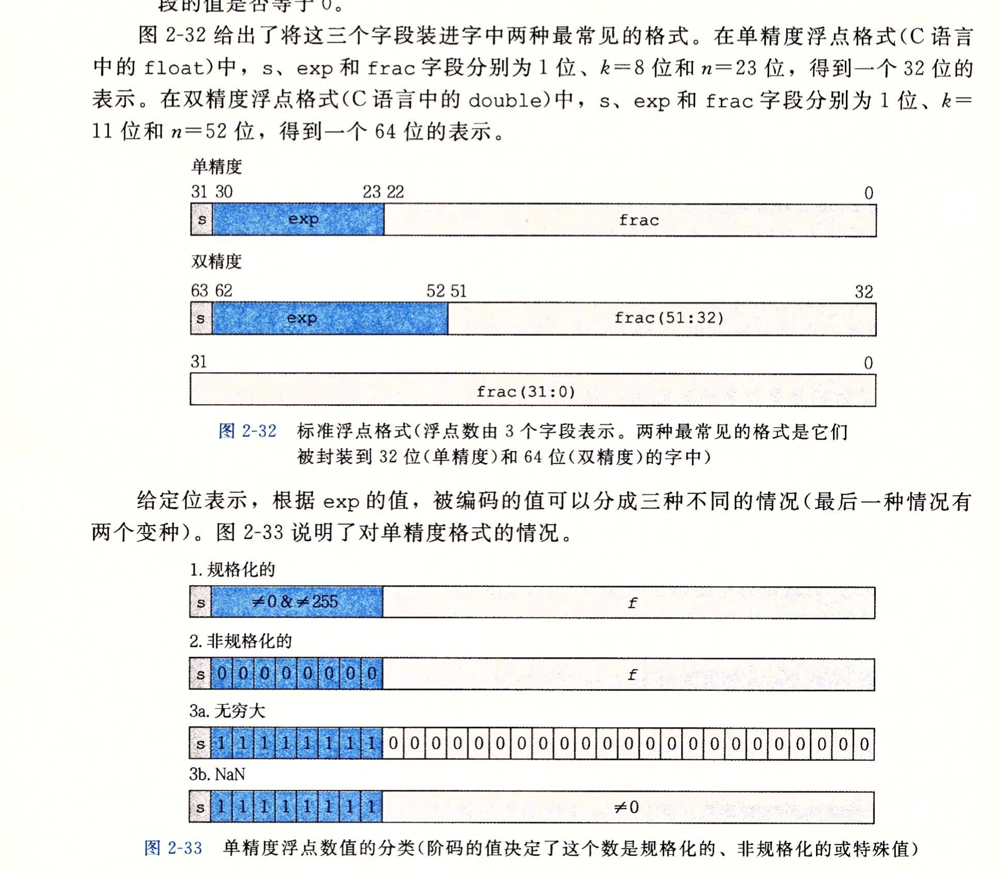
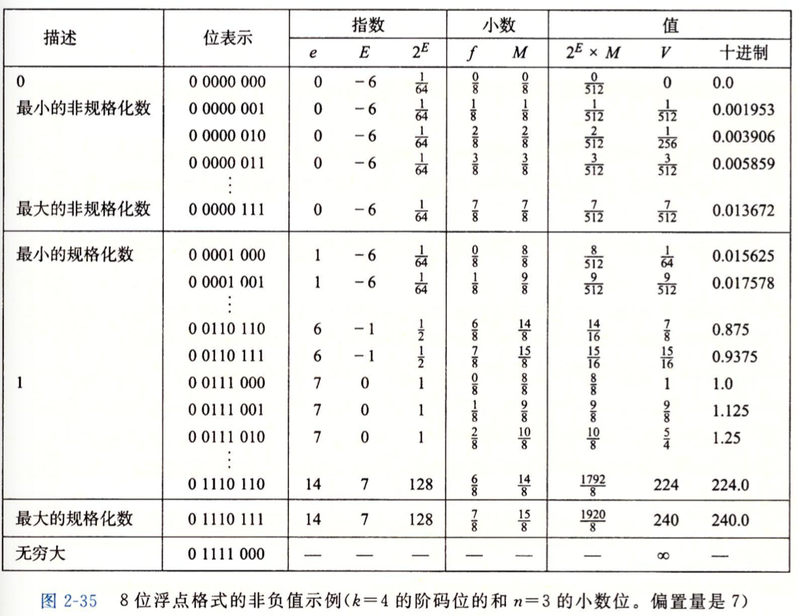

# IEEE 规格化与非规格化浮点数运算法则

## IEEE标准

### **IEEE浮点标准用**   $$V = (-1)^s * M * 2^E$$    **的形式来表示一个数.**

* **符号\(sign\)    `s` 是决定这个浮点数是负数\(s=1\)  还是正数\(s=0\),**  而对于浮点数0 的符号为解释作为特殊情况处理.
* **尾数\(significand\)  `M` 是一个二进制小数,它的范围是**   **1~** $$2-ℇ$$ , **或者是**   **0 ~** $$1-ℇ$$ .
* **阶码\(exponent\)  `E` 的作用是对浮点数加权, 这个权重是2的E次幂\(可能是负数\).**

#### **将浮点数的为表示划分为三个字段, 分别对这些值进行编码:**

* **一个单独的符号位`s`  直接编码符号`s`.**
* **`k` 位的阶码字段**  **编码阶码`E.`\( 参与得到E值的过程运算\)**
* **`n`位小数字段**   **编码尾数 `M`, 但是编码出来的值也依赖于阶码字段是否等于0.**

### **单精度32位:  符号字段s=1位,  阶码字段k=8位, 小数字段n=23位**

### **双精度64位:  符号字段s=1位,  阶码字段k=11位, 小数字段n=52位**





### 计算公式

**浮点数的值**      $$V = 2^E * M$$ ****

**阶码的值, 在规格化中** $$E = e - (2^k-^1 -1)  ;<2的k-1次方的结果再减去1>$$  ,**在非规格化中** $$E = 1-(2^k-^-1) ;<2的k-1次方的结果再减去1>$$ 

\*\*\*\*$$阶码运算中e 的值  e = (阶码字段2进制的值)   ; 例如 0110  =6  ,那么e=6$$ ****

**小数部分的值 .  在规格化中** $$M=f+1$$ ;,**非规格化中** $$M=f$$ 

$$小数部分计算中:f=尾数所有2的负幂相加$$ 

**查看阶码的二进制是全0或者全1\(都是非规格化数\), 不是的话,那么这个浮点数就是规格化数.**

### 计算示例

#### **单精度规格化浮点数**  **`0 010 1100 0  010 1101  0000 0000 0000 0000  (32位,s=1,k=8,n=23)`**

```text
查看阶码的二进制是全0或者全1(都是非规格化数), 不是的话,那么这个浮点数就是规格化数
首先计算阶码中e的值, e=010 1100 0 = 88, 
    得到e后去计算阶码E的值, E=88-(2^(k-1) -1) = 88-(2^7 - 1) =88-127 = -39
    继续计算2^E 的幂 = 2(-39) = 0.0000000000018189894
 计算M 小数部分中的 f 的值, f = 010 1101 0000..... = 2^(-2) + 2^(-4) + 2^(-5) + 2^(-7)
                                                = 0.25 + 0.0625 + 0.03125 + 0.0078125
                                                = 0.3515625
  因为是规格化数, 所以 M = f+1 = 0.3515625 +1 = 1.3515625
  
  最后结果计算 V=2^E * M = 0.0000000000018189894*1.3515625
                     V = 0.00000000000245847786
```


#### **非规格化数**

```text
0 111 1111 1  000 0000  0000 0000 0000 0000
```

结果:  无穷大


