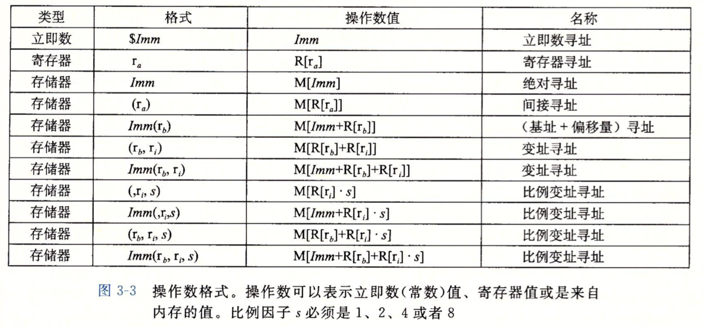

# Linux 系统笔记

## 常会用到的命令

想要查看机器代码文件的内容, 可以使用反汇编器\(objdump\).

### gcc

```bash
$gcc -Og -S mastore.c
    #无优化编译文件,生成汇编文件 mastore.s
 
$gcc -Og -c maastore.c
    #无优化编译文件,生成.o二进制文件  mastore.o
    
```

### objdump    反汇编器

```bash
$objdump -d mastore.o
    #对mastore.o文件执行反汇编, 显示可执行部分的汇编内容.(输出内容: 左侧编号是地址,右侧是汇编)
在linux下，用readelf来看ELF头部或者其它各section的内容，用objdump来对指定的内容
    （.text, .data等）进行反汇编。

但是mac os X下没有这两个命令，可以用brew来安装，
        macos> brew update && brew install binutils
    然后用greadelf和gobjdump 
```

## 处理目标文件工具

```bash
Linux 系统中有大量可用的工具来处理目标文件, GUN binutils 包是最有用的.可以运行在每个linux 平台上

     ar : 创建动态库,  插入, 删除, 列出  和提取成员. ($ ar rcs libxx.a  add.o sub.o )
strings : 列出一个目标文件中所有可打印的字符串.
  strip : 从目标文件中删除符号表信息
     nm :  列出一个目标文件的符号表中定义的符号.
   size : 列出目标文件中节的名字和大小.
readelf :  显示一个目标文件的完整结构, 包括ELF头中编码的所有信息.包含 size 和nm 的功能.
objdump : 所有二进制工具之母. 能够显示一个目标文件中所有的信息. 他最大的作用是反汇编 .text节中的二进制指令.
    ldd : 列出一个可执行文件在运行时所需要的共享库.
```

### **readelf  可重定向目标文件查看工具   \(就是 .o 文件\)**

**GUN  的 `readelf` 程序是一个查看目标文件内容很方便的工具. \(就是命令\)     `linux> readelf -a x.o  >   file.txt     #把结果放到文本内,方便查看`**

### 编译命令

```bash
linux> cpp   a.c    #预处理命令, 生成一个 ASCII码的中间文件 a.i                                    
linux> ccl   a.i    #编译器命令, 生成一个 ASCII码的汇编文件 a.s
linux> as    a.s    #汇编命令,   生成一个 可重定位目标文件  a.o
linux> ld    a.o    #链接命令, 生成一个可执行的目标文件. a.out

linux> ar  rcs libxx.a  a.o     #静态库生成命令,将 a.o 可重定位目标文件,打包成.a 静态库文件
linux> gcc  main.o -L. -lxx     #使用静态库, -L. 指定本级目录, -lxx 静态库名简写(libxx.a)
                                    #可以生成一个可执行文件

linux> gcc -rdynamic -o a.out  main.c -ldl        #生成一个会使用动态库或共享库的执行文件
linux> gcc -fpic -shared -o  libvector.so  a.c    #生成一个动态库或共享库( -fpic 表示位置无关代码)

```

### vim

```bash
    十六进制显示  :%!xxd      将当前的文本转换成十六进制来显示.
    文本格式显示  :%!xxd -r   将当前文本转换回文本格式显示.
    代码排版      gg=G  .
    替换操作      r / R ( r 一个字符,是光标后面的字符, R 替换多个,从光标后的位置向后替换).
    整行替换      :s/需要替换的内容/替换后的内容/g  (把这一行的内容替换掉).
    指定行替换    :12,29s/work/newlink/g  (把12到29行中的 work 替换成 newlink).
    全文替换      :%s/work/newlink/g      (全文的 work 替换成 newlink).
    提示替换      :s/work/gc    (c 关键字会提示用户是否替换,上面都能使用这个选项).
```

## 操作数格式



