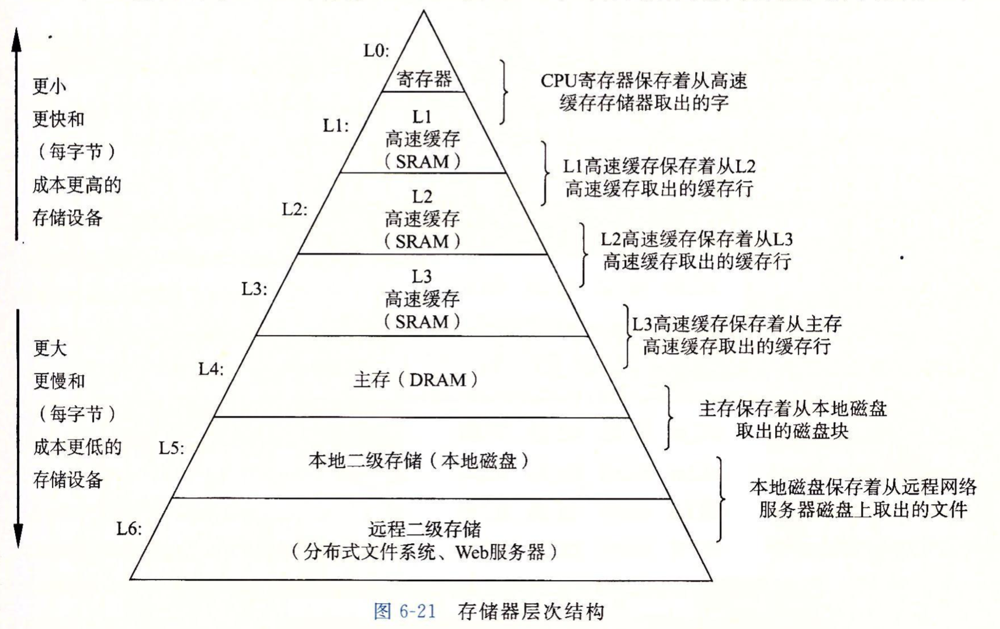
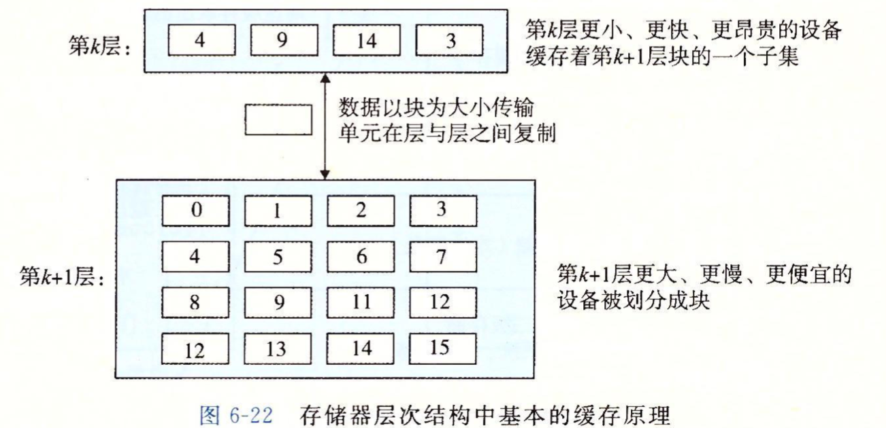

# 存储器层次结构和缓存

## 高速缓存

**高速缓存 : 就是一个小而快速的存储设备,它作为存储在更大, 也更慢的设备中的数据对象的缓冲区域. `使用高速缓存的过程称为 缓存;`**

**中心思想:** 层次结构中的每一层都缓存来自较低一层的数据对象.

**`k 是最快的存储器,  k+1比 k 要慢一个层次.   就好比 k=寄存器, k+1= L1缓存.`**

块 :  第k+1 层的存储器被划分成连续的数据对象**组块,** 称为**块.**  每个块都有唯一的地址或名字,使之区别于其他的块.

数据总是以块大小为传输单元,  一般而言,层次结构中较低层\(离CPU远\) 的设备的访问时间越长, 因此为了补偿这些较长的访问时间, 倾向于使用较大的块.

* **缓存命中**
  * 当程序需要在 **k+1** 层中的数据 **d**时,  首先会去 **k** 层的块中寻找**d**, 如果在 **k** 层的块中找到了 ,就是**缓存命中.**
* **缓存不命中**
  * 如果第 k 层没有缓存数据对象d, 那么就是**缓存不命中**
    * 当发生缓存不命中时, 第k层的缓存从 k+1 层缓存中取出包含d的那个块, 如果k层缓存已经满了,可能会覆盖现存的一个块.
      * 覆盖块的过程被称为**`替换`**或者**`驱逐`**这个块, 也称牺牲块, 决定该替换哪个块是**`替换策略`**来控制的.
    * 一旦把数据块d 从 k+1层复制到 k层之后\(d块会保持在那里\),  程序就会从k层读取数据d了,
* **缓存不命中的种类**
  * 如果第 k 层是空的,那么任何数据对象的访问都不会命中, 称为冷缓存, 此类不命中称为强制不命中.
  * k 和 k+1 存储器如果采用集合方式来放置块,那么会引起一种冲突不命中.
  * 如果程序是循环读取数组, 那么有可能造成数据比缓存大\(也就形成工作集\), 称为容量不命中.
* **缓存管理**
  * 缓存一般是操作系统或者硬件 ,又或者两个一起来管理的, 大多数时候\(有操作系统的情况下\) 缓存是自动运行的,不需要程序采取特殊的或显示的行动 \(因为是操作系统在管理\).

## 存储器层次结构小结

* 利用时间局部性,  指的是单个数据对象可能会被多次使用.
* 利用空间局部性  指的是像数组那种连续的对象可能会进行顺序遍历的操作.

