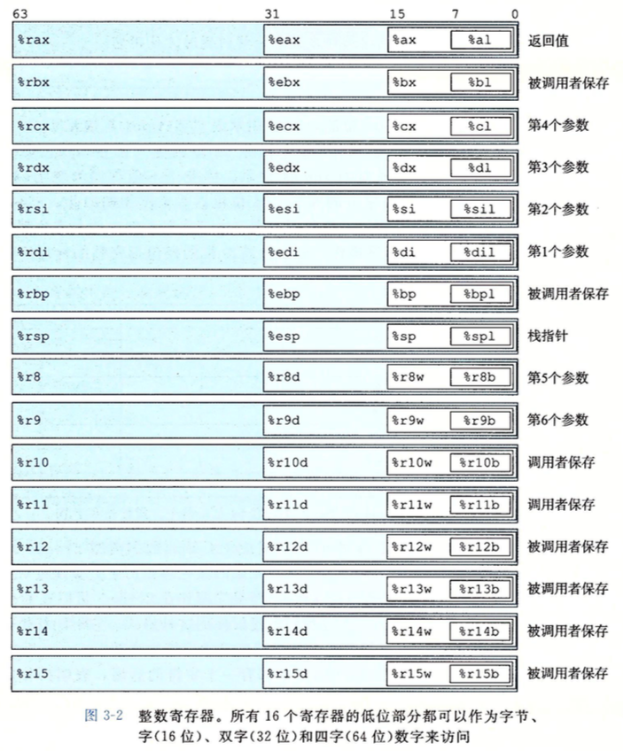

# x86汇编,寄存器

## X86-64   ATT \(AT&T\)

**整数寄存器 `文件包含16个命名的位置, 分别存储64位的值. 这些寄存器可以存储地址(对应c语言的指针) 或整数数据. 有的寄存器被用来记录某些重要的程序状态,而其他的寄存器用来保存临时数据, 例如过程的参数和局部变量,以及函数的返回值.`**

**条件码寄存器 `保存着近期执行的算数或逻辑指令的状态信息. 他们用来实现控制或数据流中的条件变化, 比如说来实现 if 和 while 语句.`**

**一组向量寄存器`可以存放一个或多个整数或浮点数.`**

**X86-64 的虚拟地址是由 64 位的字来表示的. `(在目前的实现中, 这些地址的高 16位必须设置为0,所以一个地址实际上能够指定的是 2^48 或 64TB 范围内的一个字节)`**

**程序内存包括 `程序的可执行代码, 操作系统需要的一些信息, 用来管理过程调用和返回的运行时栈, 以及用户分配的内存块(比如 malloc 分配的)`**

**操作系统`负责管理虚拟地址空间, 将虚拟地址翻译成实际处理器内存中的物理地址.`** 

**链接器的任务之一 `就是位函数调用找到匹配的函数的可以执行代码的位置.`**

**`所有以 '.' 开头的行 都是指导汇编器和链接器工作的伪指令, 我们通常可以忽略这些行.`**

```ruby
指令;

call     mult2          调用 mult2 代码段.
callq    40058b <mult2> 调用函数 mult2 需要使用的地址(40058b).


movb     %rl2b, (%bpl)  将 %rl2b 的内容保存在 %bpl 寄存器的值 所指向的内存的位置上. 1字节
movw     0x00ff,%bx     将内存地址 0x00ff 位置的2字节 复制到 %bx 寄存器中. 2字节
movl     $112,2(,%ebx,2)  将立即数 112 存入  %ebx中的值 乘 2 所得到的 内存地址中. 4字节 (注意会将高4字节置0)
movq     %r12, %rbx     将 %r12 寄存器的值, 复制到 %rbx 寄存器. 8字节
movabsq  $0x64位数,寄存器   只能将64位立即数存入 寄存器,而且只能存入寄存器.(完全可以不使用)

movzbw    %rl2b,%bx     将%rl2b中1字节数据进行高位0拓展,填充到2个字节后 存入到%bx寄存器中.
movzwq    %bx, %r14     将%bx 中的2字节数据进行高位0拓展,填充到4个字节后 存入到%r14 寄存器中.
movsbw    %rl2b,%bx     将%rl2b 中的1字节数据通过最高位来进行拓展(1就推展1,0就推展0),然后存入%bx (2字节)
movslq    %ebx,%rax     将%ebx 中的4字节数据通过最高位进行推展(1就推展1,0就推展0),然后存入%rax  (8字节)


nop                     作用是使函数代码变为16字节,提升存储器系统性能,更好放置下个代码块.
pushq    %rbx           指令表示将寄存器 %rbx 的内容压入程序栈中.
popq     %rbx           将程序栈中的内容出栈,放到 %rbx 寄存器中.也就是恢复曾经的值.
ret                     return


############################################################################
############################################################################
############################################################################

寄存器;

%rip     表示pc程序计数器,给出将要执行的下一条指令在内存中的地址.

X86-64有16个64位通用寄存器，分别是：
%rax         作为函数返回值使用。
%rbx ,%rbp ,%r12，%r13，%14，%15   用作数据存储，遵循被调用者使用规则
                                     简单说就是随便用，调用子函数之前要备份它，以防他被修改
%rdi ,%rsi ,%rdx ,%rcx ,%r8，%r9  作为函数参数, 依次对应第1参数，第2参数....
%rsp         栈指针寄存器，指向栈顶.
%r10，%r11   用作数据存储，遵循调用者使用规则，简单说就是使用之前要先保存原值.
```

### 寄存器



```ruby
%rip     表示pc程序计数器,给出将要执行的下一条指令在内存中的地址.

X86-64有16个64位通用寄存器，分别是：
%rax         作为函数返回值使用。
%rbx ,%rbp ,%r12，%r13，%14，%15   用作数据存储，遵循被调用者使用规则
                                     简单说就是随便用，调用子函数之前要备份它，以防他被修改
%rdi ,%rsi ,%rdx ,%rcx ,%r8，%r9  作为函数参数, 依次对应第1参数，第2参数....
%rsp         栈指针寄存器，指向栈顶.
%r10，%r11   用作数据存储，遵循调用者使用规则，简单说就是使用之前要先保存原值.
```

* **指令可以对这 16 个寄存器的低位字节中存放的不同大小的数据进行操作.**
  * 8位操作可以访问最低的1个字节.
  * 16位操作可以访问最低的2个字节.
  * 32位操作可以访问最低的4个字节.
  * 64位操作可以访问整个寄存器. 8个字节.
* **生成和赋值字节规则**
  * 生成1字节和2字节数字的指令会保持剩下的字节`不变`;
  * 生成4字节数字的指令会把高位4个字节`置为0;`

\*\*\*\*

### C语言数据类型在x86-64 中的大小.  \(在64位机器中,指针长8字节\)

| C声明 | Intel 数据类型 | 汇编代码后辍 | 大小\(字节\) |
| :---: | :---: | :---: | :---: |
| char | 字节 | b  \(例如: movb\) | 1 |
| short | 字 | w  \(例如: movw\) | 2 |
| int | 双字 | l  \(例如: movl\) | 4 |
| long | 四字 | q  \(例如: movq\) | 8 |
| char\* | 四字 | q  \(例如: \) | 8 |
| float | 单精度 | s  \(例如: \) | 4 |
| double | 双精度 | l  \(例如: \) | 8 |

### Intel 和 ATT 格式的不同

**编译出 intel 格式汇编的命令  :  `gcc   -S  -masm=intel  mstore.c`**

* **intel 代码省略了指示大小的后辍.**  指令是 `push` 和 `mov`,  而不是 `pushq` 和 `movq`.
* **intel 代码省略了寄存器名字前面的 '`%` ' 符号**, 用的是  `rbx` ,而不是 `%rbx`
* **intel 代码用不同的方式来描述内存中的位置**.  例如是 '`QWORD PIR [rbx]` ' 而不是 '`(%rbx)`' .
* **在带有多个操作数的情况下, 列出操作数的顺序相反.**  `mov  a ,b`  是a被赋值, `movp a,b` 是b被赋值.

### 在C程序中插入汇编的两种方法

1. 编写完整的函数, 放进一个独立的汇编代码文件中, 让汇编器和链接器把它和用C语言书写的代码合并起来.
2. 使用gcc的内联汇编, 用 sam伪指令可以在C程序中包含简短的汇编代码.\(缺少灵活性和可移植性\).


