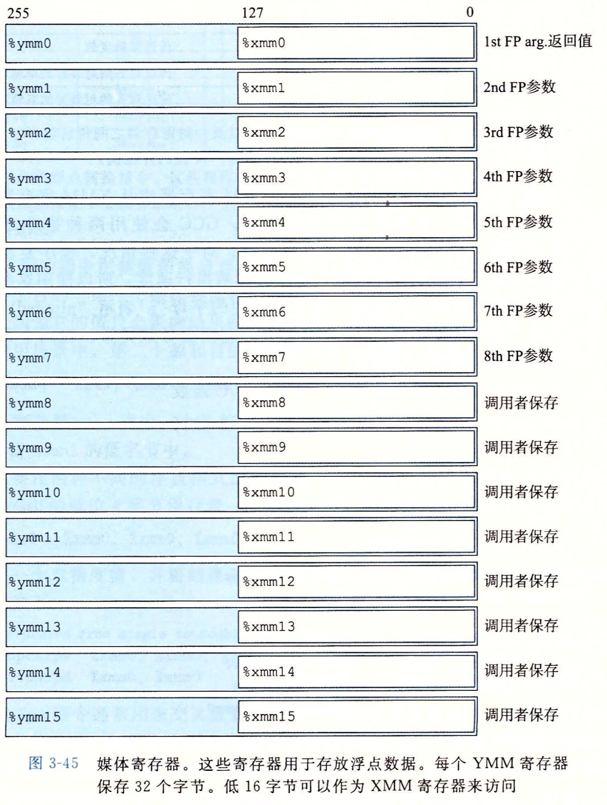

# 浮点代码

## 浮点代码

处理器的**`浮点体系结构`**包括多个方面, 会影响对浮点数据操作的程序如何被映射到机器上,包括以下内容:

* 如何存储和访问浮点树枝.  通常是通过某种寄存器方式来完成.
* 对浮点数据操作的指令.
* 向函数传递浮点数参数和从函数返回浮点数结果的规则.
* 函数调用过程中保存寄存器的规则 .   `例如:一些寄存器被指定为调用者保存寄存器,而其他的被指定为被调用者保存寄存器.`

#### 媒体\(media\)指令 , \(MMX指令,SSE指令, AVX指令\)

**`媒体指令`**支持图形和图像处理,.  **`这些指令的本意是允许多个操作以并行模式执行,`**称为 **`单指令多数据`** 或 **`SIMD`**.在这种模式中,对多个不同的数据并行执行同一个操作.

近些年来**`媒体指令`**一直在被拓展,从 **`MMX`** 到 **`SSE`**\(流式SIMD拓展\), 以及最新的 **`AVX`**\(高级向量拓展\).

每一代中,都有不同的版本. 每个拓展都是管理存储器组中的数据, 这些寄存器组名称也不相同

* **`MMX`** 中称为 **"MM"** 寄存器     \(64位\)
* **`SSE`** 中称为 **"XMM"** 寄存器  \(128位\)
* **`AVX`** 中称为 **"YMM"** 寄存器  \(256位\)  &lt;可以存放 8个32值,4个8位值, 这些值可以是整数,也可以是浮点数&gt;

2000年 Pentium4 引用 SSE2 , 媒体指令开始包括对那些**`标量浮点数据`**进行操作的指令. 使用**`XMM`** 或 **`YMM`** 寄存器的低32位或64位中的单个值.  这个标量模式提供了一组寄存器和指令, 它们更类似于其他处理器支持浮点的方式.  **所有能够执行 x86-64代码的处理器都支持 SSE2 或更高的版本, `因此 x86-64 浮点数是基于 SSE 或 AVX的`, 包括传递过程参数和返回值的规则.**

#### 以下代码基于 AVX2 , \(2013年Core i7引用\) 可以在GCC 命令中给出 -mavx2  来生成 AVX2代码

\( 基于不同版本的 SSE 以及第一个版本的 AVX 的代码从概念上来说是类似的, 只不过指令名和指令格式有所不用\)

AVX 浮点体系结构允许数据存储在 **16个 YMM** 寄存器中, 他们的名字为 **`%ymm0 ~ %ymm15`** .每个 **YMM** .存储器都是 `256位(32字节)` .**当对标量数据操作时,这些就寄存器`只保存浮点数`. `而且只是用低32位(对于float)`或 `64位(对于 double).`**

### 汇编代码用寄存器的 SSE XMM  寄存器名字 %xmm0 ~%xmm15 来引用它们. 每个 XMM寄存器都是对应的 YMM 寄存器的低 128位\(16字节\).

## 浮点传送和转换操作

下面是一组在**`内存和 XMM 寄存器之间`** 以及 **`从一个 XMM 寄存器到另一个不作任何转换的转送浮点数`**的指令.

\(引用内存的指令是标量指令, 意味着它们**`只对单个`**`而不是一组封装好的数据进行操作`.\)

\(数据可以在内存中**`(M32和M64),`**要么在XMM寄存器中\(**`图中 X 表示)`**.  无论数据对齐与否,这些指令都能正确执行, 不**过优化建议是 32位内存数据满足4字节对齐, 64位内存满足8字节对齐**\).

内存引用的制定方式与MOV 指令相同.

