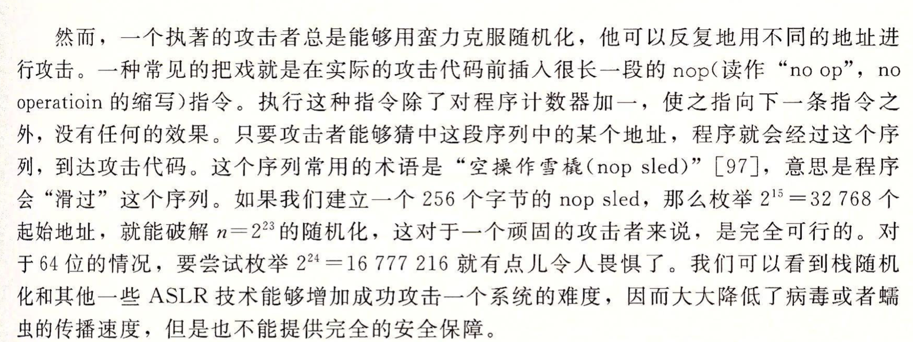

# 内存越界引用和缓冲区溢出

## 内存越界引用和缓冲区溢出

C 对数组引用不进行任何边界检查, 而且局部变量和状态信息\( 例如保存在寄存器中的值和返回地址\) 都存放在栈中.

对越界的数组元素的写操作会破坏存储在栈中的状态信息.

一种特别常见的状态破坏状态称为**`缓冲区溢出(buffer overflow).`**

```c
/* 通常,在栈中分配某个字符数组来保存一个字符串, 但是字符串的长度超出了为数据分配的空间 ;下面是个事例*/

/*  库函数的实现get（）,这个函数问题是:没办法确定是否为保存整个字符串分配了足够的空间 */
char* gets(char* s){
    int c;
    char* dest = s;
    while( (c = getchar()) != '\n'  && c != EOF )
        *dest++ = c;       /* 先解指针,然后将c传入, 再把指针值+1, 指向下一个元素 */
    if( c == EOF && dest == s)
          return NULL;      /* 没有读取的内容 */
      *dest ++ = '\0';     /* 终止字符串标示 */
      return s;
  }
/* 读取输入行并将其写回 */
void echo(){
    char buf[8];    /* 任何长度超过7个字符的字符串都会导致写越界 (最后有个 '\0' )*/ 
    gets(buf);
    push(buf);
}


/* echo 函数 所产生的汇编代码, 实际给buf 分了8个字节空间, 但是又预留了8个, 总共16字节空间 */
echo:
    subq     $24,%rsp        申请24 个字节的栈空间,8个是返回值,8个来存放buf,和8个未使用的空间.
    movq     %rsp,%rdi       将char buf 的地址当作参数传入 gets 函数
    call     gets            调用gets 函数
    movq     %rsp,%rdi       同上
    call     puts            同上
    add      $24,%rsp        释放栈空间
    ret
```


* 0 ~ 7      **`不会有影响`**
* 9 ~ 23    **`会覆盖未被使用的预留8字节的空间, 但是无法读取出来.`**
* 24 ~ 31  **`会覆盖call 调用的时候所保存的 %rip 寄存器(PC), echo函数的返回地址`**
* 32 +        **`会覆盖 caller(栈帧)中保存的状态, 后果非常严重.`**

## 对抗缓冲区溢出攻击

**蠕虫:  可以自己运行,并且能够将自己的等效副本传播到其他机器.**

**病毒:  能将自己添加到包括操作系统在内的其他程序中, 但它不能独立运行.**

**`蠕虫和病毒都试图在计算机中传播它自己的代码段.`**

\*\*\*\*

### **栈随机化**

为了在系统中插入攻击代码, 攻击者既要插入代码,也要插入指向这段代码的指针,这个指针也是攻击字符串的一部分. 产生这个指针需要知道这个字符串放置的栈地址.

**栈随机化的思想是**  栈的位置在程序每次运行时都有变化.  因此,即使许多机器都运行同样的代码, 他们的栈地址都是不同的.

**实现方式是:  `程序开始时, 在栈上分配一段 0~n 字节之间的随机大小的空间.  例如使用分配函数alloc 在栈上分配制定字节的空间. 程序不使用这段空间, 但是它会导致程序每次执行时后续的栈地址位置发生了变化.  分配的范围n 必须足够大,才能获得足够多的栈地址变化,但是又要足够小, 不至于浪费程序太多空间.`**

在 Linux 系统中,**栈随机化**以及变成了标准行为. 它是更大的一类技术中的一种, 这种技术称为 地址空间布局随机化\(ASLR\).

```text
采用ASLR,每次运行时程序的不同部分,包括程序代码,库代码,栈,全局变量和堆数据,都会被加载到内存的不同区域.
```



### 栈破坏检测

栈破坏通常发生在超越局部缓冲区边界时.

在C语言中没有可靠的方法来防止对数组的越界写, 但是,我们能够在发生了越界写的时候,在造成任何有害结果之前,尝试检测到它.

GCC会在产生的代码中加入一种**`栈保护者机制`**.其思想是在栈帧中任何局部缓冲区与栈之间存储一个特殊**`"金丝雀值", 也称为哨兵值.`** 该值是在程序每次运行时随机产生的, 因此, 攻击者没有简单的办法能够知道他是什么.

在恢复寄存器状态和从函数返回之前, 程序检查这个金丝雀值是否被该函数的某个操作或者该函数调用的某个函数的某个操作改变了. **`如果是的,那么程序异常终止.`**

GCC会试着确定一个函数是否容易遭受栈溢出攻击, 并且自动插入这种溢出检测.

```c
还是和上面一样的代码, 只不过GCC插入了 栈保护者机制 和 金丝雀值

/* 读取输入行并将其写回 */
void echo(){
    char buf[8];    /* 任何长度超过7个字符的字符串都会导致写越界 (最后有个 '\0' )*/ 
    gets(buf);
    push(buf);
}


汇编版本. 这个会避免栈溢出
echo:
    subq    $24,%rsp        申请24字节的栈空间.buf 8字节,金丝雀8字节, 空8字节.
    movq    %fs:40,%rax     检索金丝雀,指明用段寻址 从内存中读入. (80286 寻址方式)
    movq    %rax,8(%rsp)    将%rax寄存器的金丝雀值 存储在栈上
    xorl    %eax,%eax       异或运算, 将%rax寄存器清0
    movq    %rsp,%rdi       将栈顶的buf 地址拿出来存入%rdi寄存器 (第一个参数)
    call    gets            调用gets函数, 把%rdi传入, 然后将%rip寄存器PC入栈.
    movq    %rsp,%rdi       还是将 buf 地址取出 接着传入另一个函数
    call    puts            同样操作, 调用puts 函数
    movq    8(%rsp),%rax    检索金丝雀的值, 将在栈上的 金丝雀值取出来
    xorq    %fs:40,%rax     与原本的金丝雀值进行 异或运算.
    je      .L9             两者结果为0 则跳转(正常执行), 否则异常终止.
    call    __stack_chk_fail      堆栈已损坏, 程序直接异常终止
.L9:
    addq    $24,%rsp        释放栈空间
    ret


金丝雀的值存放在一个特殊的段中, 标识为 "只读", 这样攻击者就不能覆盖存储的金丝雀值.
在恢复寄存器状态和返回前, 函数将存储在栈位置处的值与金丝雀值作比较(xorq指令),
    如果结果为0,函数会正常执行(跳转到.L9).非零的值表明栈上的金丝雀值被修改过,代码会调用错误处理例程.

GCC 只在函数中有局部 char 类型缓冲区的时候才插入这样的代码.
```


\*\*\*\*

