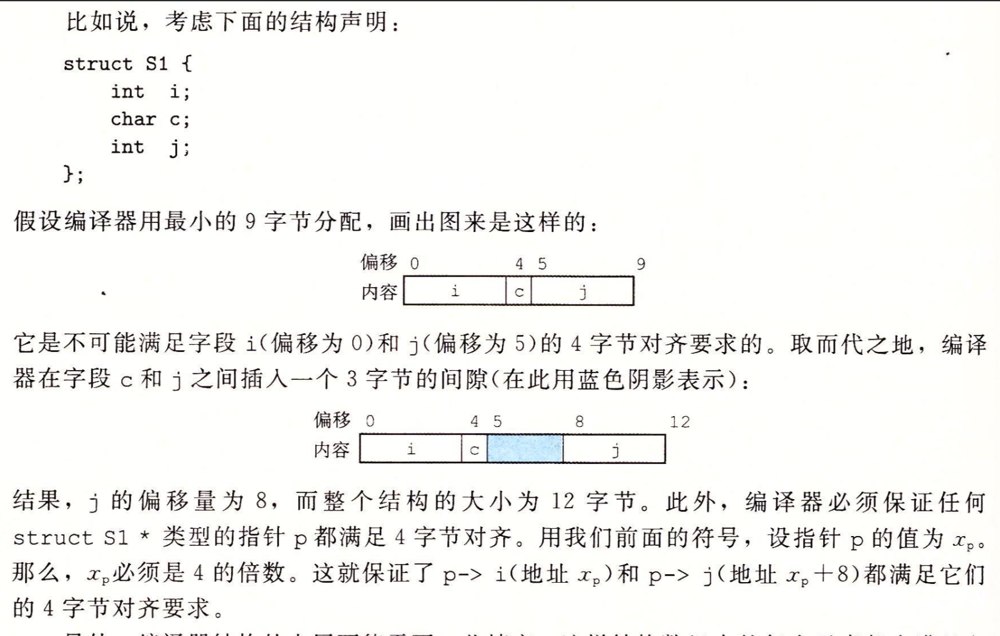
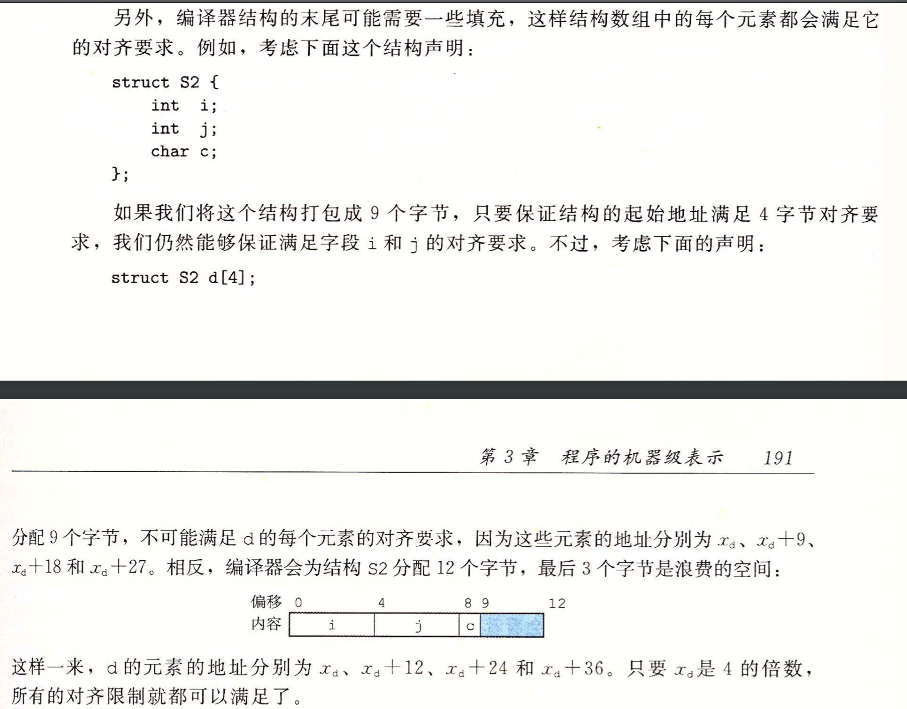

# 数据对齐 和指针

## 数据对齐

许多计算机系统对基本数据类型的**`合法地址`**做了一些限制,要求**`某种类型对象`**的`地址`必须是某个值的**`K(通常是2,4或者8)`** 的倍数.

这种**`对齐限制`**简化了形成 **处理器和内存系统** 之间**`接口`**的**`硬件设计`**.

> 例如: 假设一个处理器总是从内存中取8个字节, 则地址必须为8的倍数. 如果我们能保证将所有的double 类型数据的地址对齐成8的倍数, 那么就可以用一个内存操作来读或者写值了.  否则, 我们可能需要执行两次内存访问, 因为对象可能被分放在两个8字节内存块中.

#### 无论数据是否对齐,x86-64 硬件都能正确工作.不过inter还是建议对齐数据以提高内存系统的性能.

### 对齐原则

**对齐原则是 `任何K字节的基本对象的地址必须是K 的倍数.`**


确保每种数据类型都是按照制定方式来组织和分配,即每种类型的对象都满足它的对齐限制,就可以保证实施对齐.

```text
对于结构的代码, 编译器可能需要在字段的分配中插入间隙,以保证每个元素都能满足它的对齐要求.
而结构本身对它的起始地址也有一些对齐要求.
```





## 指针

```ruby
int a[3] ;

int a[2] 等价于 *(a + 2)
        实际运算都是 a地址+2*4

如果出现强制类型转换, 那么就会有所变动. ( 强制类型转换的优先级比 + 号高)
  char* p = NULL;
 
 (int*)p +3  这个结果是 p+3*4 = p+12
 (int*)(p+3) 这个结果是 p+3*1 = p+3
 将指针从一种类型强制转换成另一种类型, 只改变它的类型, 而不改变它的值
 
 
 函数指针的值是该函数机器代码表示中第一条指令的值.
         int fun(int p);   /* 假设fun第一条指令地址是 0x0008 */
 
         int (*fp)(int p);
         fp = fun;          /* fp的值也是 0x0008 */
         int ret = fp(10);   /* 函数调用 */
```

