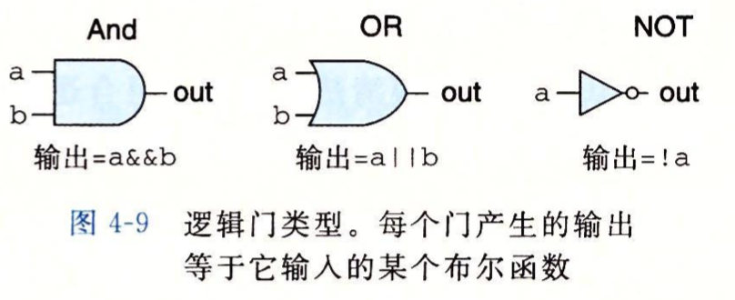
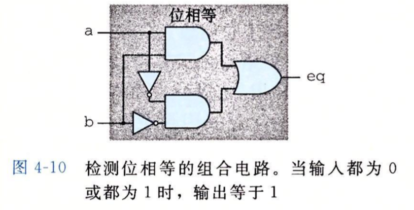
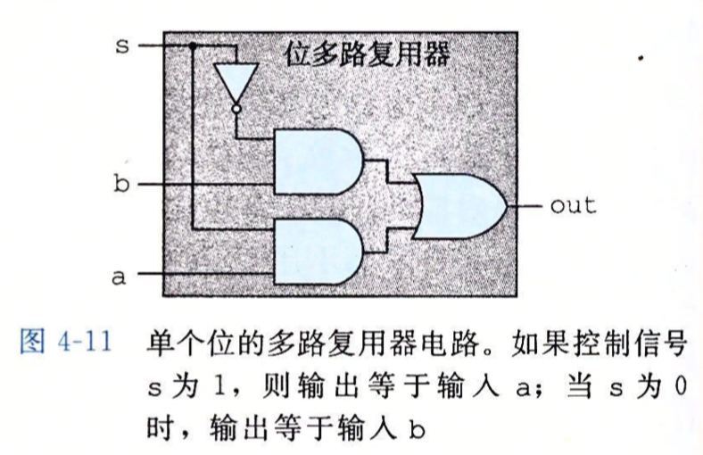

# 逻辑设计和硬件控制语言 HCL

在硬件设计中, 用**电子电路来计算对位运算的函数**, 以及在各种存储单元中存储位.

大多数现代电路技术都是用信号线上的**高电压**和**低电压**来表示不同的值, 在当前的技术中, **逻辑1是用1.0伏特左右的高电压表示的**, **而逻辑0是用0.0伏特左右的低电压表示的.**

* **一个数字系统需要三个组成部分:**
  * **计算对位操作的函数的组合逻辑**
  * **存储位的存储单元**
  * **控制存储单元更新的时钟信号**

**使用 `HCL`  \(硬件控制语言\)  来描述不同处理器设计的控制逻辑.\(描述的是硬件结构,不是程序行为\)**

**控制逻辑 是设计微处理器中做难的部分.**

## 逻辑门

**逻辑门是数字电路的基本计算单元,  它们产生的输出, 等于它们输入位的某个布尔函数.**

* **HCL和C语言很像,对位运算.**
  * **AND**  用    **`&&`**  表示
  * **OR**     用   **`||`**   表示
  * **NOT**  用   **`!`**    表示

**逻辑门是对单个位的数进行操作,而不是整个字.**

**逻辑门总是活动的, 一旦一个门的输入变化了, 在很短时间内,输出就会相应地变化.**

## 组合电路和 HCL 布尔表达式

**将很多的逻辑门组合成一个网, 就能构成 `计算块` 称为 `组合电路.`**

* **构建网的限制**
  * **每个逻辑门的输入必须连接到下述选项之一:**
    * **`一个系统输入(称为主输入)`**
    * **`某个存储器单元的输出`**
    * **`某个逻辑门的输出`**
  * **两个或多个逻辑门的输出不能连接在一起.**否则它们会使线上的信号矛盾, 可能会导致一个不合法的电压或电路故障.
  * **这个网必须是无环的.**就是在网中不能有路径经过一系列的门而形成一个回路, 这样的回路会导致该网络计算的函数有歧义.

### 检测位相等的组合电路

上图的 HCL表达式为:   **`bool ep = ( a && b) || ( !a && !b)`**;      `上述代码简单的定义了位级 (数据类型bool表明了这一点) 信号eq ,  它是输入a和b的函数.`  `'=' 这个等号将信号名与一个表达式联系起来. 与c不同,它是给表达式一个名字,  ep这个名字就代表了后的表达式.`

### 单个位的多路复用器电路

**多路复用器根据输入控制信号的值, 从一组不同的数据信号中选出一个.**

**在这个单个位的多路复用器中,两个数据信号是`输入位 a 和 b` , `控制信号是输入位s`.**

**当s为`1`时, 输出等于`a`,   当s为`0`时, 输出等于`b`.**

**两个AND 门决定了是否将它们相对应的数据输入传送到 OR门.**

**HCL表达式为  :   `bool  out = (s && a) || ( !s  &&  b);`**

### HCL和C的区别

**HCL 表达式很清楚地表明了组合逻辑电路和C语言中逻辑表达式的对应之处.  它们都是用布尔操作来对输入进行计算的函数.**

* **两种表达式计算方法之间的区别 \(  C和HCL \)**
  * **因为组合电路是由一系列的逻辑门组成, 它的属性是输出会持续的相应输入的变化. ``**`如果电路的输入变化了,在一定的延迟之后, 输出也会相应地变化`, **`相比之下C表达式只能在程序执行过程中被遇到时才进行求值.`**
  * **C 的逻辑表达式允许参数是任意整数, 0表示 FALSE ,其他任何值都表示 TRUE,  `而逻辑门只对位值0 和 1 进行操作.`**
  * **C 逻辑表达式有个属性就是 它们可能之被部分求值. 如果一个AND 或 OR  操作的结果 只用对一个参数求值就能确定,那么就不会对第二个参数求值了,  `例如 C表达式 ( a && !a) && func(b,c)`**    _`这里函数 func 是不会被调用的, 因为表达式 ( a && !a) 求值为0.`_  **而逻辑组合没有部分求值这条规则, 逻辑门只是简单的相应输入的变化.**

