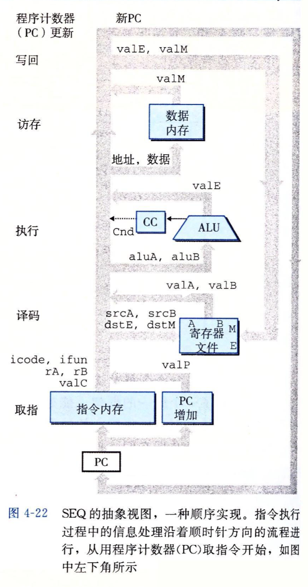

# SEQ 硬件结构

## SEQ抽象视图

实现所有 Y86-64 指令所需要的计算可以被组织成6个基本阶段: **取指,译码,执行,访存,写回,PC更新.**

* **取指**
  * **`将程序计数器寄存器作为地址, 指令内存读取指令的字节. PC增加器 计算 valP, 即增加了程序计数器`**
* **译码**
  * 寄存器文件有两个端口**`A和B,`** 从这两个端口同时**读寄存器值`valA`** 和 **`valB`**.
* **执行**
  * **`执行阶段会根据指令的类型,将算术/逻辑单元(ALU) 用于不同的目的.`** 
    * **对整数操作**, 它要执行指令所指定的运算. **对其他指令**, 它会作为一个加法来计算增加或减少栈指针, **或者计算有效地址**,**或者只是简单的增加0, 将一个输入传递到一个输出.**
  * **条件码寄存器\( CC \) 有三个条件码位.   ALU 负责计算条件码的新值.**
    * 当执行条件传送指令时, 根据条件码和传送条件来计算决定是否更新目标寄存器.
    * 同样, 当执行一条 条件跳转指令时, 会根据条件码和跳转类型来计算分支信号 **`Cnd.`**
* **访存**
  * **在执行访存操作时, 数据内存`读出`或`写入`一个内存字.**
    * 指令和数据内存访问的是**`相同的内存位置`**,**但是用于不同的目的.**
* **写回**
  * **寄存器文件有两个写端口**
    *  **端口`E` 用来写 `ALU` 计算出来的值**
    * **端口 `M`  用来写入`数据内存`中读出的值**
* **PC更新**
  * 程序计数器的新值选择自:
    * **`valP`**   , 下一条指令的地址  \( **`valP = PC + 已读的指令字节`** \)
    * **`valC`**  ,  调用指令或跳转指令指定的目标地址 \( **`call 地址 , jmp  地址`** \)
    * **`valM`** ,  从内存读取的返回地址 \( **`ret`** \)

### 实现 SEQ 所需要的硬件

