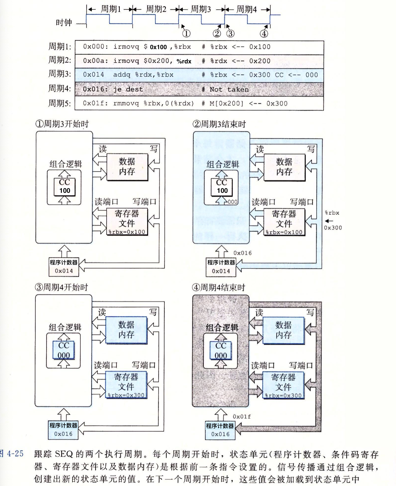
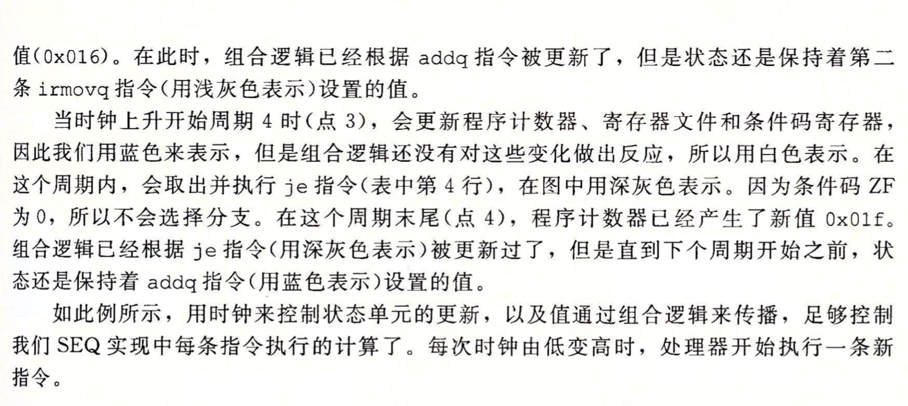
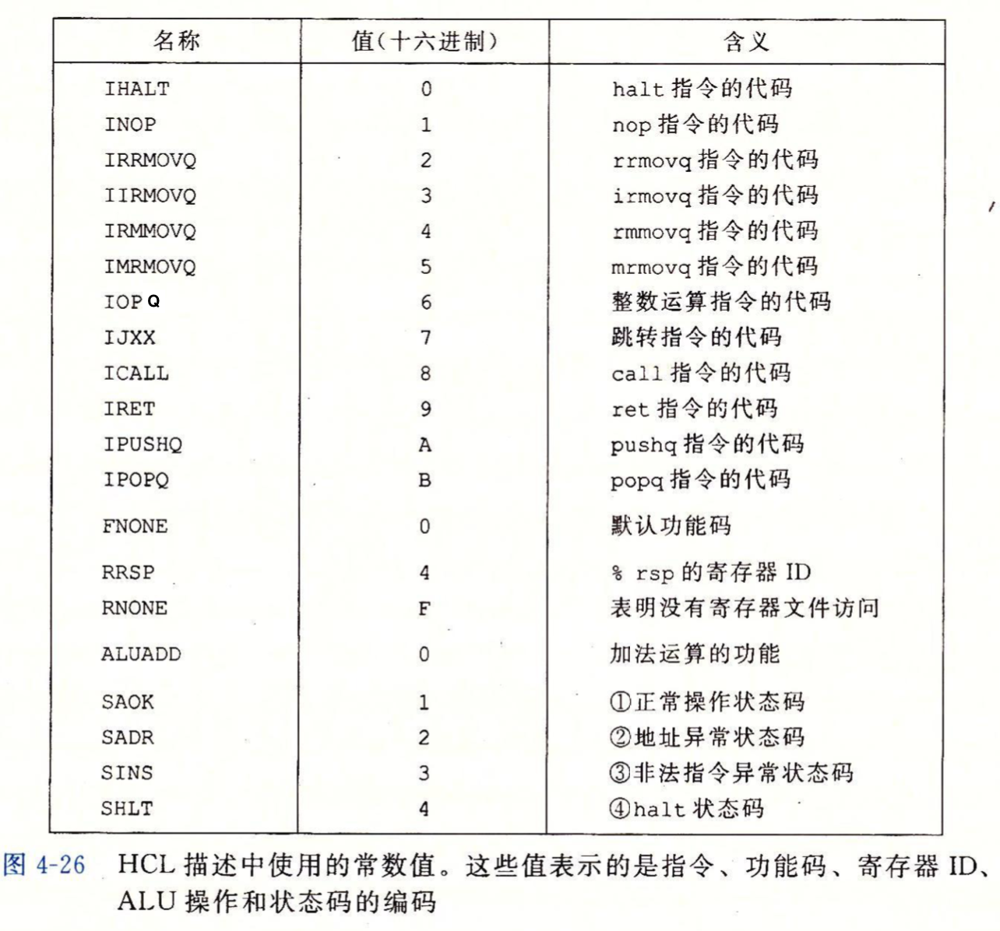
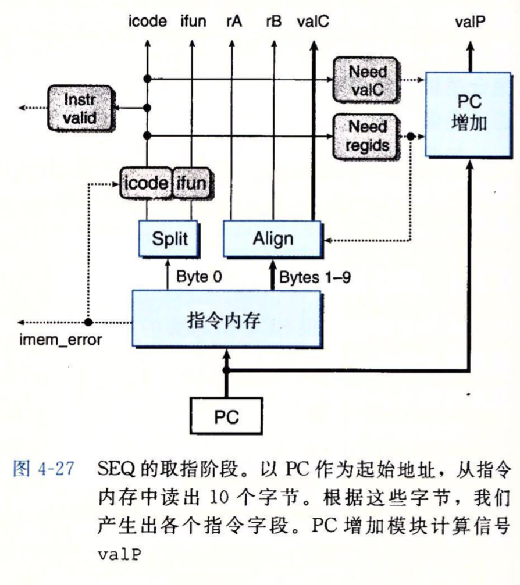

# SEQ 硬件结构

## SEQ抽象视图


实现所有 Y86-64 指令所需要的计算可以被组织成6个基本阶段: **取指,译码,执行,访存,写回,PC更新.**

* **取指**
  * **`将程序计数器寄存器作为地址, 指令内存读取指令的字节. PC增加器 计算 valP, 即增加了程序计数器`**
* **译码**
  * 寄存器文件有两个端口**`A和B,`** 从这两个端口同时**读寄存器值`valA`** 和 **`valB`**.
* **执行**
  * **`执行阶段会根据指令的类型,将算术/逻辑单元(ALU) 用于不同的目的.`** 
    * **对整数操作**, 它要执行指令所指定的运算. **对其他指令**, 它会作为一个加法来计算增加或减少栈指针, **或者计算有效地址**,**或者只是简单的增加0, 将一个输入传递到一个输出.**
  * **条件码寄存器\( CC \) 有三个条件码位.   ALU 负责计算条件码的新值.**
    * 当执行条件传送指令时, 根据条件码和传送条件来计算决定是否更新目标寄存器.
    * 同样, 当执行一条 条件跳转指令时, 会根据条件码和跳转类型来计算分支信号 **`Cnd.`**
* **访存**
  * **在执行访存操作时, 数据内存`读出`或`写入`一个内存字.**
    * 指令和数据内存访问的是**`相同的内存位置`**,**但是用于不同的目的.**
* **写回**
  * **寄存器文件有两个写端口**
    *  **端口`E` 用来写 `ALU` 计算出来的值**
    * **端口 `M`  用来写入`数据内存`中读出的值**
* **PC更新**
  * 程序计数器的新值选择自:
    * **`valP`**   , 下一条指令的地址  \( **`valP = PC + 已读的指令字节`** \)
    * **`valC`**  ,  调用指令或跳转指令指定的目标地址 \( **`call 地址 , jmp  地址`** \)
    * **`valM`** ,  从内存读取的返回地址 \( **`ret`** \)

### 实现 SEQ 所需要的硬件


* **白色方框** 
  * 表示**`时钟寄存器`**.  **`程序寄存器PC`** 是SEQ 中唯一的时钟寄存器.
* **浅蓝色方框**
  * 表示硬件单元 包括,内存,ALU等等.
* **灰色矩形方框**
  * 表示控制逻辑块,这些块用来从一组信号源中进行选择,或者用来计算一些布尔函数.
* 白色圆圈
  * 它们是线路的标识, 不是硬件单元
* **粗线**
  * 每条这样的线都代表一簇64根线,并列连接在一起, 将一个字从硬件的一部分传送到另一部分.
* **细线**
  * 根据线上要携带的值的类型,每条这样的线实际上都代表一簇 4或8根线.
* **虚线**
  * **代表芯片上单元与块之间传递的控制值.**

**指令序列中所有的计算都有这样的性质, 每一行都代表某个值的计算\(如valP\), 或激活某个硬件单元\(如内存\).**


**上图中, 我们要实现的控制逻辑, 它能在不同硬件单元之间传送数据, 以及操作这些单元, 使得对每个不同的指令执行指定的运算.**  _**`这就是控制逻辑块的目标`**_

## SEQ  的时序 \(重要\)

在**`处理组织成阶段`** , 它们是用符号写的, 那些赋值是从上到下顺序执行的. _**`然而,与硬件结构的运行根本不同, 一个时钟变化会引发一个经过组合逻辑的流, 来执行整个指令.`**_ 

* **SEQ 的实现包括`组合逻辑`和`两种存储器设备`:**
  * **存储设备:**
    * **时钟寄存器 \( `程序计数器` 和 `条件码寄存器`\)**
    * **随机访问存储器 \(`寄存器文件`, `指令内存和数据内存`\)**
  * **组合逻辑 `不需要任何时序` 或`控制` ,   `只要输入变化了,值就通过逻辑门网络传播`**
    * 也可以将随机访问存储器堪称和组合逻辑一样的操作, 根据地址输入产生字.
    * 由于指令内存用来读指令, 因此我们可以将整个单元看成是组合逻辑.

**还有四个硬件单元需要对他们的时序进行明确的控制**

* **`程序计数器`, `条件码寄存器`, `数据内存` 和 `寄存器文件`**
  * 这些单元通过一个时钟信号来控制, 它触发新值装载到寄存器, 以及将值写到随机访问存储器.
  * 每个时钟周期, 程序计数器都会装载新的指令地址. 只有在指令整数运算指令时,才会装载条件码寄存器.
  * 只有在执行 rmmovq,pushq,或 call  指令时,才会写数据内存.
  * 寄存器文件的两个写端口允许 **每个时钟周期更新两个程序寄存器**, 不过可以用特殊寄存器**ID 0xF** 作为端口地址, 来表明此端口不应该执行写操作.

**要控制处理器中活动的时序, 只需要寄存器和内存的时钟控制.**

```text
原则:  从不会回读
    处理器从来不需要为了完成一条指令的执行而去读由该指令更新了的状态.

这条原则对实现的成功至关重要.
```




* 条件码的顺序是  ZF,SF,OF 
* **不同颜色的代码表明电路信号是如何在被执行的不同指令相互联系的**




## SEQ 阶段的实现

**设计实现 SEQ 所需要的控制逻辑块 HCL 描述.**



```text
nop    指令只是简单的经过各个阶段, 除了要将PC 加一,不进行任何处理.
halt   指令是的处理器状态被设置为 HLT, 导致处理器停止运行.
```

### 取指阶段




