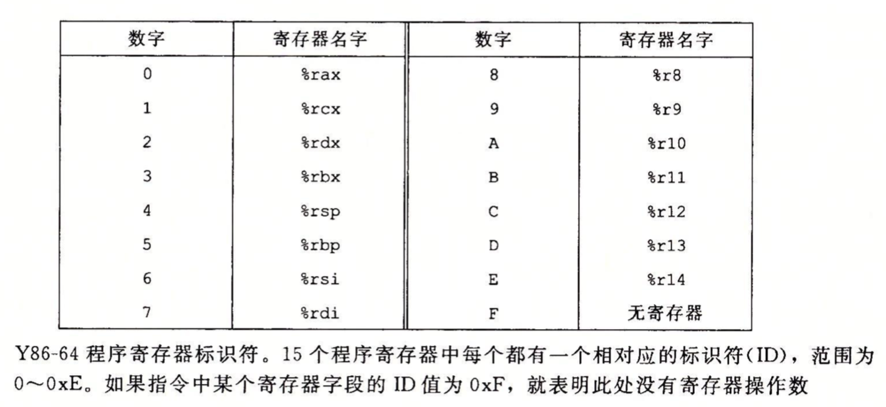

# Y86-64 指令和编码

## Y86-64 指令

```text
显示数据传送指令
   x86-64 的movq 指令分成了4个不同的指令: irmovq, rrmovq, mrmovq 和 rmmovq,
        分别显示的制定源和目的的格式. 源可以是立即数(i),寄存器(r),或内存(m).
              指令第名字的第一个字母表明了源的类型,第二个决定了目的类型.
                   两个内存传送指令中的内存应用方式是简单的基址和偏移量形式.(不支持第二变址寄存器)
                        不允许从一个内存地址传送到另一个内存地址.另外也不允许将立即数传送到内存.
          irmovq     $1,%rax
          rmmovq     %rax,%rsi

整数运算操作指令
     有四个整数操作指令, OPq代表这些指令,它们是: addq, subq, andq,xorq.
          在 Y86-64 中它们只会对寄存器数据进行操作, (而x86-64 还允许这些指令对内存操作)
                这些指令会设置3个条件码: ZF(零),SF(符号) 和OF(溢出)
          addq     %rax,%rdx

跳转指令
     有7个跳转指令,jXX 代表这些指令,  两个操作数都必须是寄存器.
          它们是: jmp(无条件), jle(<=), jl(<), je(==), jne(!=) ,jge(>=), jg(>)
               testq  %rax,%rbx    #测试%rbx和%rax的值
               jle    .L1          #当%rbx的值 小于等于 %rax的值时, 跳转到.L1

条件传送指令
     有6个条件传送指令,cmovXX代表这些指令,
          它们是: cmovle(<=), cmovl(<), cmove(==), cmovne(!=), cmovge(>=) 和 cmovg(>)
              比对两个参数(源和目的), 符合条件时将 源值 赋值给 目的值.
                  test     %rax,%rcx     #测试%rcx和%rax
                  cmovle   %rax,%rbx     #当上面的 %rcx <= %rax 成立时,将%rax的值给%rbx

调用指令
     call指令将返回地址入栈(call指令下面指令的地址),然后跳转到目的地址,ret指令从这样的调用中返回.
           call   .L2         #调用.L2,将下面的addq指令地址入栈.
           addq   %rax,%rbx   

入栈和出栈指令
     pushq和popq指令实现了入栈和出栈.就像在x86-64中一样.
          pushq     %rax    #%rax寄存器的值入栈

指令停止指令
     halt指令停止指令的执行,x86-64中有一个于之相当的指令hlt,对于x86-64的应用程序来说,不允许使用
          因为它会导致整个系统暂停运行. 
               但是对于Y86-64来说,执行halt指令会导致处理器停止,并将状态码设置为 HLT.
                    halt               #处理器停止运行
```


## 指令编码

指令的字节级编码,  **每条指令需要1~10个字节不等.  这取决于需要哪些字段**. **每条指令的第一个字节辨明指令的类型. 这个字节分为两个部分, 每部分4位**; **`高4位是代码(code)部分, 低4位是功能(function)部分.`**

**功能值只有在一组相关指令共用一个代码时才有用.**


```text
如下图寄存器所示, 15个程序寄存器中每个都有一个相对应的范围在0到0xE之间的寄存器标识符(register ID)

Y86-64中的寄存器编号跟x86-64中的相同,程序寄存器存在CPU中的一个寄存器文件中,这个寄存器文件就是
    一个小的,以寄存器ID作为地址的随机访问存储器.
在指令编码中以及在我们的硬件设计中,当需要指明不应文档任何寄存器时,就用ID值0xF来表示.
```



```text
有的指令只有一个字节长,而有的需要操作数的指令编码就更长一些.
首先,可能有附加的寄存器指示符字节, 制定一个或两个寄存器.(在最上面的图中,rA和rB就是寄存器字段)

从指令的汇编代码中可以看到,根据指令类型,指令可以指定用于数据源和目的的寄存器,或是用于地址计算的
    基址寄存器.

没有寄存器的操作数的指令 ,例如ret 和 call 指令, 就没有寄存器指示符字节.
那些只需要一个寄存器操作数的指令(irmovq,pushq和popq)将另一个寄存器指示符设为 0xF.在实现中很有用
```


