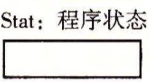
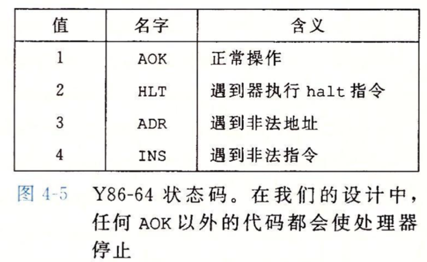

# Y86-64 指令集体系结构,指令和编码以及异常结构

**定义一个指令集体系结构\(例如 Y86-64\), 包括`定义各种状态单元`, `指令集`和`它们的编码`, `一组编程规范`和`异常事件处理`.**

## 程序员可见的状态

**Y86-64 程序中的每条指令都会读取或修改处理器状态的某些部分,** 这称为**`程序员可见状态`**`(这里的程序员指的是 即可用汇编代码编写程序的人,也可以是产生机器级代码的编译器).`

在处理器实现中,只要我们**保证机器级程序能够访问程序员可见状态**,就不需要完全按照ISA暗示的方式来表达和组织这个处理器状态.

**Y86-68的状态也类似于 x86-64,有15个寄存器**: **`%rax,%rcx,%rdx,%rbx,%rsp,%rsi,%rdi,%r8到%14`**. \(每个寄存器存储一个**`64位`**的字, 寄存器**`%rsp 被入栈,出栈,调用和返回指令作为栈指针`**, 除此之外,**寄存器没有固定的含义和固定值.** 

有三个1位的**条件码: `ZF(零), SF(负)和 OF(溢出),`** 它们保存着最近的算数和逻辑指令所造成影响的有关信息. **`程序计数器(PC) 存放`**`当前正在执行指令的地址.(%rip)`

内存从概念上来讲就是一个很大的字节数组, **`保存着程序和数据`**, Y86-64用**`虚拟地址来引用内存位置`**.  **硬件和操作系统联合起来将虚拟地址翻译成实际或物理地址**,  **指明数据实际存在内存中哪个地方.**\(认为虚拟内系统向Y86-64提供了**一个单一的字节数据映像\)**

**程序状态的最后一个部分是状态码 `Stat`, 它表明程序执行的总体状态. 它会指示是正常运行还是出现某种异常.**\(例如当一条指令试图去读非法的内存地址使\)


## Y86-64 指令

**在 Y86-64中, 每个值都是8字节的, 称为一个字.**

```ruby
显示数据传送指令
   x86-64 的movq 指令分成了4个不同的指令: irmovq, rrmovq, mrmovq 和 rmmovq,
        分别显示的制定源和目的的格式. 源可以是立即数(i),寄存器(r),或内存(m).
              指令第名字的第一个字母表明了源的类型,第二个决定了目的类型.
                   两个内存传送指令中的内存应用方式是简单的基址和偏移量形式.(不支持第二变址寄存器)
                        不允许从一个内存地址传送到另一个内存地址.另外也不允许将立即数传送到内存.
          irmovq     $1,%rax
          rmmovq     %rax,%rsi

整数运算操作指令
     有四个整数操作指令, OPq代表这些指令,它们是: addq, subq, andq,xorq.
          在 Y86-64 中它们只会对寄存器数据进行操作, (而x86-64 还允许这些指令对内存操作)
                这些指令会设置3个条件码: ZF(零),SF(符号) 和OF(溢出)
          addq     %rax,%rdx

跳转指令
     有7个跳转指令,jXX 代表这些指令,  两个操作数都必须是寄存器.
          它们是: jmp(无条件), jle(<=), jl(<), je(==), jne(!=) ,jge(>=), jg(>)
               testq  %rax,%rbx    #测试%rbx和%rax的值
               jle    .L1          #当%rbx的值 小于等于 %rax的值时, 跳转到.L1

条件传送指令
     有6个条件传送指令,cmovXX代表这些指令,
          它们是: cmovle(<=), cmovl(<), cmove(==), cmovne(!=), cmovge(>=) 和 cmovg(>)
              比对两个参数(源和目的), 符合条件时将 源值 赋值给 目的值.
                  test     %rax,%rcx     #测试%rcx和%rax
                  cmovle   %rax,%rbx     #当上面的 %rcx <= %rax 成立时,将%rax的值给%rbx

调用指令
     call指令将返回地址入栈(call指令下面指令的地址),然后跳转到目的地址,ret指令从这样的调用中返回.
           call   .L2         #调用.L2,将下面的addq指令地址入栈.
           addq   %rax,%rbx   

入栈和出栈指令
     pushq和popq指令实现了入栈和出栈.就像在x86-64中一样.
          pushq     %rax    #%rax寄存器的值入栈

指令停止指令
     halt指令停止指令的执行,x86-64中有一个于之相当的指令hlt,对于x86-64的应用程序来说,不允许使用
          因为它会导致整个系统暂停运行. 
               但是对于Y86-64来说,执行halt指令会导致处理器停止,并将状态码设置为 HLT.
                    halt               #处理器停止运行
```


## Y86-64 指令编码

指令的字节级编码,  **每条指令需要1~10个字节不等.  这取决于需要哪些字段**. **每条指令的第一个字节辨明指令的类型. 这个字节分为两个部分, 每部分4位**; **`高4位是代码(code)部分, 低4位是功能(function)部分.`**

**功能值只有在一组相关指令共用一个代码时才有用.**


```text
如下图寄存器所示, 15个程序寄存器中每个都有一个相对应的范围在0到0xE之间的寄存器标识符(register ID)

Y86-64中的寄存器编号跟x86-64中的相同,程序寄存器存在CPU中的一个寄存器文件中,这个寄存器文件就是
    一个小的,以寄存器ID作为地址的随机访问存储器.
在指令编码中以及在我们的硬件设计中,当需要指明不应文档任何寄存器时,就用ID值0xF来表示.
```


```ruby
有的指令只有一个字节长,而有的需要操作数的指令编码就更长一些.
首先,可能有附加的寄存器指示符字节, 制定一个或两个寄存器.(在最上面的图中,rA和rB就是寄存器字段)

从指令的汇编代码中可以看到,根据指令类型,指令可以指定用于数据源和目的的寄存器,或是用于地址计算的
    基址寄存器.

没有寄存器的操作数的指令 ,例如ret 和 call 指令, 就没有寄存器指示符字节.
那些只需要一个寄存器操作数的指令(irmovq,pushq和popq)将另一个寄存器指示符设为 0xF.在实现中很有用
```


有些指令需要一个附加**4字节常数字**, 这个字作为**`irmovq`** 的**立即数数据**,**`rnnovq和mrmovq`**的**地址指示符的偏移量**,以及**`分支指令和调用指令`**的**目的地址**.\(分支指令和调用指令的目的是一个**绝对地址**, **`地址值+立即数`**\) ,**采用小端编码**

### **Y86-64 指令转编码**

```ruby
用十六进制来表示指令 rmmovq %rsp,0x123456789abcd(%rdx) 的字节编码(rmmovq rA,rB :40rArBD)
    从指令集表中可知 rmmovq的第一个字节为 40  编码
        源寄存器 %rsp 寄存器标识符的ID是4, 编码在rA, 存放在 40指令编码的后面
        目的地址的 基址寄存器%rdx 的标识符是2, 编码在rB, 存放在rA 4源寄存器后面, 最后是偏移量D
            偏移量编码放在8字节常数字中, 首先将偏移量扩展到8字节, (大端) 0x000123456789abcd
                生成偏移量的小端编码 : 0xcd ab 89 67 45 23 01 00
                最后添加指令编码生成最终编码:  
                    4042cdab896745230100     =  rmmovq %rsp,0x123456789abcd(%rdx)
```

**指令集的一个重要的特性就是字节编码必须有唯一的解释.而且必须从第一个字节开始处理.否则就是一个不合法的字节序列.**

```text
例子:
  汇编代码                              这边是对应的十六进制编码:
    .pos 0x100  #表示这段目标代码的起始地址是 0x100
      irmovq   $15,%rbx               30F30F00000000000000    #30字节地址是 0x100
      rrmovq   %rbx,%rcx              2031
    loop:    
      rmmovq  %rcx,-3(%rbx)           4013FDFFFFFFFFFFFFFF    #40字节地址是 0x10C
      addq    %rbx,%rcx               6031
      jmp     loop                    700C01000000000000
```

## Y86-64 异常

**状态码  `Stat` , 它描述程序执行的总体状态**  



* **代码值为`1`,  命名为 `AOK`**
  * 表示程序执行正常, 而其他的代码则表示发生了某种异常.
* **代码值为`2`,  命名为`HLT`**
  * 表示处理器执行了一条 halt指令\( 停止指令执行的指令\)
* **代码值为`3`,  命名为 `ADR`**
  * 代表处理器试图从一个非法地址读或写以及取数据的时候.\(访问越界\)
* **代码值为`4`,  命名为 `INS`**
  * 表示遇到了非法的指令代码.

**处理方式:** `对于Y86-64而言,简单的让处理器停止执行指令`,   而更完整的设计中处理器会调用一个**异常处理程序**,\(这过程被指定用来处理遇到的某种类型的异常, 包括信号处理程序\).



## Y86-64 程序

```ruby
第一种转码方式:
C函数源代码
    long sum(long *start, long count){
        long sum = 0;
        while(count){
            sum += *start;
            start++;
            count--;
        }
        return sum;
    }
                    start是%rdi, count是%rsi
X86-64 汇编代码                 Y86-64 汇编代码
sum:                           sum:
    movl    $0,%rax                irmovq    $8,%r8
    jmp     .L2                    irmovq    $1,%r9
.L3:                               xorq      %rax,%rax
    addq    (%rdi),%rax            andq      %rsi,%rsi
    addq    $8,%rdi                jmp       test
    subq    $1,%rsi            loop:
.L2:                               mrmovq    (%rdi),%r10
    testq    %rsi,%rsi             addq      %r10,%rax
    jne      .L3                   addq      %r8,%rdi
    rep;ret                        subq      %r9,%rsi
                               test:
                                   jne       .loop        #count != 0 时,跳转
                                   ret
```

### 一个完整的程序的例子

**左边是地址和 汇编器的ASCII码格式输出,右边是汇编代码和数据,**

```ruby
                               # 执行从地址0开始
0x000:                      | .pos  0                
0x000: 30f40002000000000000 | irmovq  stack, %rsp    #设置堆栈指针,%rsp = 0x200
0x00a: 803800000000000000   | call    main           #执行主程序,下个指令 halt 地址进栈
0x013: 00                   | halt

                            #4个元素的数组 , 每个元素都是8字节
0x018:                      |   .align      #数组开始处在8字节边界处对齐.
0x018:                      | array:        #这标号表示数组的开头,相当于数组指针,是个立即数
0x018: 0d000d000d000000     |    .quad  0x000d000d000d
0x020: c000c0000c000000     |    .quad  0x00c000c000c0
0x028: 000b000b000b0000     |    .quad  0x0b000b000b00
0x030: 00a000a000a00000     |    .quad  0xa000a000a000

0x038:                      | main:
0x038: 30f71800000000000000 |     irmovq   array,%rdi     #把立即数 数组指针值赋给了%rdi
0x042: 30f60400000000000000 |     irmovq   $4,%rsi        #数组大小是4
0x04c: 805600000000000000   |     call     sum
0x055: 90                   |     ret

                            #下面这个函数原型是 long sum(long * start, long count)
                            # start 是 %rdi, count 是%rsi
0x056:                      | sum:
0x056: 30f80800000000000000 |    irmovq    $8,%r8
0x060: 30f90100000000000000 |    irmovq    $1,%r9
0x06a: 6300                 |    xorq      %rax,%rax
0x06c: 6266                 |    andq      %rsi,%rsi
0x06e: 708700000000000000   |    jmp       test
0x077:                      | loop:
0x077: 50a70000000000000000 |    mrmovq    (%rdi),%r10
0x081: 60a0                 |    addq      %r10,%rax
0x083: 6087                 |    addq      %r8.%rdi
0x085: 6196                 |    subq      %r9,%rsi
0x087:                      | test:
0x087: 747700000000000000   |    jne       loop
0x090: 90                   |    ret

                            # 这里表示栈的开始位置, 由高地址向低地址增长
0x200:                      | .pos  0x200
0x200:                      | stack:
```

在这个程序中, 以' **`.`** ' 开头的词是**`汇编伪指令`**, 它告诉**汇编器调整地址**,**以便在那儿产生`代码`或插入一些`数据`.  \(**伪指令 `.pos 0` \(第二行\) 告诉汇编器应该从地址0处开始产生代码. 也是Y86-64程序的起点\)

接下来的一条指令\(第三行\) **初始化栈指针**, 可以在**程序结尾**处看到声明了一个标号 **`stack`**, 并且用一个**`.pos`** 伪指令\(第39行\)指明地址`0x200`,  **因此栈会从这地址开始, 向低地址增长.** \(我们必须保证栈不会增长的太大,以至于覆盖代码或者其他程序数据\).

程序第 8 ~ 13行 声明了一个 **4字**的数组\(**每个值都是8字节**\),都是以 **`.quad`** 开头,地址从低到高增长. 标号 **`array`** 表明了这个数组的起始, **并且在8字节边界处对齐\(用 `.align 8` 伪指令指定\).**

**第16~19行给出了 "main" 过程, 在过程中对那四字数组调用了 sum 函数, 然后停止.**

下面给出一个 **`指令集模拟器,`** 称为 **`YIS`**, **模拟 Y86-64机器代码程序的执行**, 并且进行输出,   **对比代码执行前和程序执行完毕后的状态,\( 前面是执行前,  后面是执行后, 最底下是内存stack状态\)**


