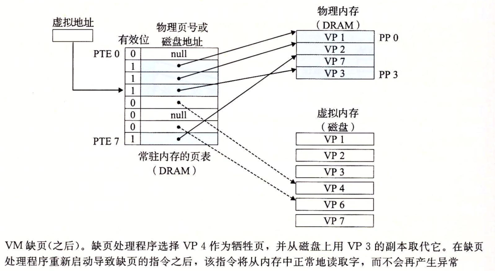
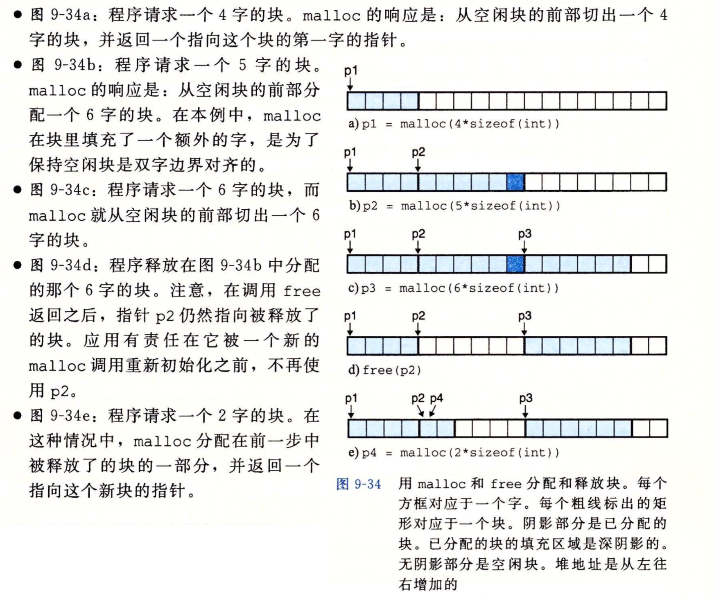
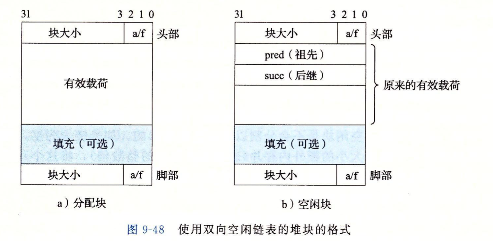

# 虚拟内存

为了更加有效地管理**内存**且少出错，现代系统提供了对**主存**的抽象概念，叫做`虚拟内存(VM）`。

* `虚拟内存`是硬件异常，硬件地址翻译，主存，磁盘文件和内核软件的完美交互。
* 为每个进程提供一个**大的**，**一致的**和 **私有的**地址空间。
* 提供了3个重要能力。
  * 将主存看成磁盘地址空间的**高速缓存**。
    * 只保留了活动区域，并根据需要在磁盘和主存间来回传送数据，高效使用主存。
  * 为每个进程提供**一致**的地址空间
    * 简化内存管理
  * 保护了每个进程的地址空间不被其他进程破坏。
* 程序员为什么要理解它？
  * `虚拟内存`是中心的。
    * 遍布在计算机系统所有层次，硬件异常，汇编器，连接器，加载器，共享对象，文件和进程中扮演重要角色。
  * `虚拟内存`是强大的。
    * 可以创建和销毁内存片\(chunk\)
    * 将内存片映射到磁盘文件的某个部分。
    * 其他进程共享内存。
    * **例子**
      * 能读写内存位置来修改磁盘文件内容。
      * 加载文件到内存不需要显式的拷贝。
  * `虚拟内存`是危险的
    * 引用变量，间接引用指正，调用`malloc`动态分配程序，就会和虚拟内存交互。
    * 如果使用不当，将遇到复杂危险的与内存有关的错误。
    * **例子**
      * 一个带有错误指针的程序可以立即崩溃于**段错误**或者**保护错误**。
      * 运行完成，却不产生正确结果。
* 本章从两个角度分析。
  * `虚拟内存`如何工作。
  * 应用程序如何使用和管理`虚拟内存`。

## 物理和虚拟寻址

* `物理地址(Physical Address,PA)`:计算机系统的主存被组织为M个连续的字节大小的单元组成的数组。每个字节的地址叫`物理地址`.
* CPU访问内存的最自然的方式使用`物理地址`，这种方式称为`物理寻址`。 - 早期的PC，数字信号处理器，嵌入式微控制器以及Cray超级计算机使用`物理寻址`。
* 现代处理器使用的是`虚拟寻址(virtual addressing)`的寻址形式。
  * CPU通过生成一个`虚拟地址(Virtual address,VA)`来访问主存。
    * 将`虚拟地址`转换为`物理地址`叫做`地址翻译(address translation)`。
  * `地址翻译`也需要CPU硬件和操作系统之间的紧密结合。
    * CPU芯片上有叫做`内存管理单元(Memory Management Unit,MMU)`的专用硬件。
      * 利用存储在主存中的查询表来动态翻译虚拟地址。
      * 查询表由操作系统管理。

## 地址空间

`地址空间(address space)`是一个非负整数`地址`的有序集合。

* 如果地址空间中整数是连续的，我们说它是`线性地址空间(linear address space)`。
  * 为了简化讨论，我们总是假设使用线性地址空间。
* 在一个带虚拟内存的系统中，CPU从一个有`N=2^n`个地址的`地址空间`中生成虚拟地址，这个地址空间称为`虚拟地址空间(virtual address space)`。
* 一个`地址空间`大小是由**表示最大地址所需要的位数**来描述的。
  * 如`N=2^n`个地址的虚拟地址空间叫做`n`位地址空间。
  * 现在操作系统支持`32位`或`64位`。
* 一个系统还有`物理地址空间`,它与系统中物理内存的`M=2^m`\(假设为2的幂\)个字节相对应。

`地址空间`的概念很重要，因为它区分了**数据对象\(字节\)**和 它们的**属性\(地址\)**。

* 每个`字节(数据对象)`一般有**多个** 独立的`地址(属性)`。每个地址都选自**不同**的地址空间。
  * 比如一般来说。
    * `字节` 有一个在`虚拟地址空间`的`虚拟地址`。
    * 还有一个在`物理地址空间`的 `物理地址`。
    * 两个地址都能访问到这个`字节`。
  * 类似现实世界的**门牌号**, 和**经纬度**。

```text
计算方式如下:      单位换算: K(2^10), M(2^20), G(2^30), T(2^40), P(2^50), E(2^60)
    虚拟地址位数(n)    虚拟地址(N)     最大可能的虚拟地址
        8          2^8 = 256byte      2^8 -1  = 255
        16         2^16=65536=64K     2^16 -1 = 65535
        32         2^32 = 4G          2^32 -1 = 4G-1
        48         2^48 = 256T        2^48 -1 = 256T -1
        64         2^64 = 16E         2^64 -1 = 16E -1
```

## 虚拟内存作为缓存的工具

感悟

> 在讲述这一小章之前，必须交代一下我对`虚拟存储器`概念的**存疑**。  
>   
> 原本我以为`虚拟存储器`=`虚拟内存`。  
>   
> 以下是`虚拟内存`的定义
>
> > **`虚拟内存`是计算机系统内存管理的一种技术。它使得应用程序认为它拥有连续的可用的内存（一个连续完整的地址空间），而实际上，它通常是被分隔成多个物理`内存碎片`，还有部分暂时存储在外部`磁盘存储器`上，在需要时进行数据交换**
>
> 而在下面的定义我们可以看到`CSAPP`中认为`虚拟存储器`是存放在磁盘上的。  
>   
> 在此，我们姑且当做两者是不同的东西，以后有更深刻的理解，再思考。

`虚拟内存(VM)`被组织为一个存放在**磁盘**上的N个连续字节大小的单元组成的数组。

* 每个字节都有一个唯一的`虚拟地址`，这个虚拟地址作为到数组的索引。
* `磁盘`上数组的内容被缓存到`主存`中。
  * 同存储器层次结构其他缓存一样，`磁盘`上的数据被分割称`块`。
    * 这些`块`作为**磁盘和主存**之间的传输单元。
    * `虚拟页(Virtual Page,VP)`就是这个`块`
      * 每个`虚拟页`大小为`P=2^p`字节。
  * **物理存储器**被分割为`物理页`,大小也为`P`字节
    * 也被称为`页帧(page frame)`
* 任何时候，`虚拟页`的集合都被分为3个不相交的**子集**。

  * **未分配的**:VM系统还未分配\(或者创建\)的页。未分配的`块`没有任何数据与之相关联。
    * 不占用磁盘空间
    * 通过`malloc`来分配
  * **缓存的**：当前缓存在物理存储器的已分配页。
  * **未缓存的**:没有缓存在物理页面存储器中的已分配页。


### DRAM缓存的组织结构

`DRAM`表示虚拟存储器系统的缓存，在主存中缓存`虚拟页`,有两个特点。

* `DRAM`缓存不命中处罚十分严重。
  * 因为`磁盘`比`DRAM`慢100000多倍。
* **访问一字节开销**
  * :从一个磁盘的一个扇区读取第一个字节的时间开销要比从该扇区中读连续的字节慢大约100000倍

`DRAM`缓存的组织结构由这种**巨大的不命中开销**驱动。因此有以下特点。  
\(**有些地方不是特别懂，之后看完第六章应该会好点**\)

* `虚拟页`往往很大。
  * 4KB~2MB
  * 访问一字节开销的原因才要这么大。
* `DRAM`缓存是`全相联`
  * 也就是： 任何`虚拟页`都能放在任何`物理页`中。
  * 原因在于**大的不命中惩罚**
* 更精密的**替换算法**
  * 替换错了虚拟页的惩罚很高。
* `DRAM`缓存总是`写回`
  * 因为对磁盘的访问时间很长
  * 而不用`直写`

### 页表


判断**命中**和**替换**又多种软硬件联合提供。

* 操作系统软件，MMU中的地址翻译硬件和`页表(page table)`。
  * `页表`是存放在物理存储器的数据结构。
    * `页表`将虚拟页映射到物理页。
    * **地址翻译硬件**将虚拟地址转换为物理地址都会读取`页表`。
  * 操作系统负责维护`页表`的内容，以及磁盘及DRAM之间来回传送页。


* `页表`就是一个`页表条目(Page Table Entry,PTE)`的数组.
  * **虚拟地址空间** 中每个页在**页表**的固定偏移量处都有一个`PTE`.
  * 每个`PTE`由一个`有效位`和`n位地址字段`。
    * `有效位`表明虚拟页是否被缓存。
      * 如果有效位存在，那么地址字段指向对应的物理存储器。
      * 如果有效位不存在。
        * 地址字段要么为NULL
        * 要么指向虚拟页在磁盘所在的位置。

### 页命中


* 一个**页命中的过程**。
* 一个**虚拟地址**转换为**物理地址**的过程。

### 缺页

在虚拟存储器的习惯说法中，**DRAM缓存不命中**称为`缺页`。

处理过程如下：

* 读取虚拟地址所指向的`PT`。
* 读取`PTE`有效位，发现未被缓存，触发**缺页异常**。
* 调用**缺页异常处理程序**
  * 选择牺牲页。
  * 如果牺牲页发生了改变，将其拷贝回磁盘\(因为是`写回`\)
  * 需要读取的页代替了牺牲页的位置。
  * 结果：牺牲也不被缓存，需要读取的页被缓存。
* 中断结束，重新执行最开始的指令。
* 在`DRAM`中读取成功。

`虚拟存储器`是20世纪60年代发明的，因此即使与SRAM缓存使用了不同的术语。

* `块`被称为`页`。
* **磁盘**和**DRAM**之间传送`页`的活动叫做`交换(swapping)`或者`页面调度(paging)`。
* 有`不命中`发生时，才换入页面，这种策略叫做`按需页面调度(demand paging)`。
  * 现代系统基本都是用这个。



### 分配页面

比如某个`页面`所指向地址为`NULL`，将这个地址指向磁盘某处，那么这就叫`分配页面`。

此时`虚拟页`从`未分配`状态 变为 `未缓存`。


### 又是局部性拯救了我们


`虚拟存储器`工作的相当好，主要归功于老朋友`局部性(locality)`

尽管从头到尾的**活动页面数量**大于**物理存储器**大小。

但是在局部内，程序往往在一个较小的**活动页面集合**工作

* 这个**集合**叫做`工作集(working set)`或者叫`常驻集(resident set)`
  * 初始载入开销比较大。
* 程序有良好的`时间局部性`，`虚拟存储器`都工作的相当好。
* 如果程序实在很烂，或者物理空间很小，`工作集`大于`物理存储器`大小。这种状态叫`颠簸(thrashing)`.
  * 这时，页面不断换进换出。性能十分低。

> **统计缺页次数**  
>   
> 可以利用Unix的`getrusage`函数检测缺页数量。

## 虚拟内存作为存储器的管理工具

实际上，操作系统为每个**进程**提供一个独立的`页表`。


因此，`VM`简化了`链接`和`加载`,`代码`和`数据共享`,以及应用程序的`存储器`分配。

* **简化链接**
  * 独立的空间地址意味着每个进程的存储器映像使用相同的格式。
    * 文本节总是从`0x08048000`\(32位\)处或`0x400000`\(64位\)处开始。
    * 然后是数据，bss节,栈。
  * 一致性极大简化了`链接器`的设计和实现。
* **简化加载**
  * `加载器`可以从不实际拷贝任何数据从磁盘到存储器。
  * 基本都是**虚拟存储系统**完成。

    > 将一组连续的`虚拟页`映射到任意一个文件中的任意位置的表示法称作`存储器映射`。Unix提供一个称为`mmap`的系统调用，允许程序自己做存储器映射。在9.8详细讲解。
* **简化共享**
  * 独立地址空间为操作系统提供了一个管理用户进程和操作系统自身之间的一致`共享`机制.
  * 例子
    * 操作相同的操作系统内核代码
    * C标准库的`printf`.
  * 因此操作系统需要将**不同进程**的适当的虚拟页映射到**相同**的物理页面。
    * 多个进程共享这部分代码的一个拷贝。
    * 而不是每个进程都要加载单独的内核和C标准库的拷贝。
* **简化存储器分配**.
  * 即`虚拟页`连续\(虚拟页还是单独的\)，`物理页`可以不连续。使得分配更加容易。

## 虚拟内存作为存储器保护的工具

任何现代操作系统必须为操作系统提供手段来**控制**对 **存储器系统**的访问。

* 不应该允许用户进程修改它的只读文本段。
* 不允许它读或修改任何内核的代码和数据结构
* 不允许读写其他进程的私有存储器。
* 不允许修改共享的虚拟页，除非所有共享者显示允许这么做\(通过调用明确的**进程间通信**）

方式：在`PTE`上添加一些格外的`许可位`来控制访问。


* `SUP`:是否只有在内核模式下才能访问?
* `READ`：读权限。
* `WRITE`：写权限。

如果指令违反了许可条件，触发**一般保护性异常**，然后交给**异常处理程序**，`Shell`一般会报告为`段错误(segmentaion fault)`。

## 地址翻译


认识到**硬件**在支持虚拟存储器中的角色

以下是接下来可能要用到的符号，作参考。


* **形式上**来说，**地址翻译**是一个N元素的虚拟地址空间\(`VAS`\)中的元素和一个M元素的物理地址空间（`PAS`\)元素之间的映射,

  

* 以下展示了`MMU`\(`Memory Management Unit`,**存储器管理单元**\)如何利用页表实现这样的功能
  * `页表基址寄存器(Page Table Base Register,PTBR)`指向当前页表。
  * `n`位的`虚拟地址`包含两个部分
    * 一个`p`位的**虚拟页面偏移**\(`Virtual Page Offset`,`VPO`\)
    * 一个`n-p`位的**虚拟页号**\(`Virtual Page Number`,`VPN`\)
      * `MMU`利用`VPN`选取适当的`PTE(页面条目,Page Tabe Entry,PTE)`
  * `虚拟地址空间  除以  页大小可以得到虚拟页的个数  VPN`
  * **页面条目** \(`PTE`\)中**物理页号\(`PPN`\)**和虚拟地址中的`VPO`串联起啦，即是`物理地址`
    * `PPO`和`VPO`是相同的
    * 不要忘记`VPN`,`PPN`都是块，都是首地址而已，所以需要偏移地址`PPO`,`VPO`
    * `PPN 的位数和 与VPN 的位数可能不相等, 不要被图迷惑.`


图\(a\)展示**页面命中**,CPU硬件执行过程

* 第一步：处理器生成虚拟地址，把它传送给`MMU`。
* 第二步: `MMU`生成`PTE`地址\(`PTEA`\)，并从**高速缓存/主存**请求中得到它。
* 第三步: **高速缓存/主存**向MMU返回`PTE`。
* 第四步: `MMU`构造物理地址\(PA\)，并把它传送给**高速缓存/主存**。
* 第五步: **高速缓存/主存**返回所请求的数据字给处理器。

**页面命中**完全由硬件处理，与之不同的是，处理**缺页**需要 硬件和操作系统内核协作完成。

* 第一到三步: 与**命中**时的一样
* 第四步:`PTE`有效位是零，所以`MMU`触发异常，传递CPU中的**控制**到操作系统内核中的 **缺页异常处理程序**。
* 第五步:**缺页异常处理程序**确定出物理存储页中的牺牲页，如果这个页面已经被修改，则把它换出到磁盘。
* 第六步:**缺页异常处理程序**调入新的页面，并更新存储器中的`PTE`。
* 第七部:**缺页异常处理程序**返回到原来的进程，再次执行导致缺页的指令，之后就是**页面命中**一样的步骤。

```text
计算方式:
给定一个32位的虚拟地址空间和一个24位的物理地址,对于下面页大小P,确定 VPN, VPO, PPN 和 PPO的位数
   虚拟地址空间 n = 32 ,物理地址空间 m = 24,P是页面大小 和 n 以及 PTE 有关系: 2^n / 2^m =PTE
      PTE是页面条目, p = log_2(P)
  P=2^p(页面大小)      VPN位数=n-p   VPO位数=p=PPO   PPN位数=m-p   PPO位数=p=VPO
     P                  VPN位数       VPO位数         PPN位数       PPO位数
 1KB (log_2(P)=10)     32-10=22      log_2(P)=10     24-10=14    log_2(P)=10=VPO
    2KB                  21            11               13         11
    4KB                  20            12               12         12
    8KB                  19            13               11         13
```


### 利用 TLB 加速地址翻译 \(VA-&gt;PA\)

每次CPU产生一个虚拟地址，`MMU`就必须查阅一个`PTE`，以便将**虚拟地址**翻译为 **物理地址**。

* 在最糟糕的情况下，会从**内存**中取数据，代价是**几十** 到**几百个**周期
* 如果`PTE`碰巧缓存在`L1`中，那么开销就下降到**一到两个**周期

许多系统都**试图消除这样的开销**，他们在`MMU`中包含了一个关于`PTE`的小缓存，称为`翻译后备缓冲器(Translation Lookaside Buffer,TLB)`。

* `TLB`是一个小的，虚拟寻址的**缓存**。
  * 每一行都保存着一个由单个`PTE`组成的块。
  * `TLB`通常用于高度的**相连性**
  * 如图所示

    

    ```text
    - 用于组选择和行匹配的`索引`和`标记字段`是从虚拟地址中的**虚拟页号**中提取出来的。
    - 如果`TLB`有T=2^t个组
      - 那么`TLB索引`(`TLBI`)是由VPN的`t`个最低位组成。(对应于`VPO`)
      - `TLB标记`(`TLBT`)是由VPN中剩余位组成(对应于`VPN`)
    ```
* 下图展示了`TLB`命中步骤

  * 关键点:所有的**地址翻译步骤**都是在芯片上的MMU中执行的，因此非常快

  

  * `TLB`命中
    * 第一步:CPU产生虚拟地址。
    * 第二步和第三部:`MMU`从`TLB`取出对应的`PTE`。
    * 第四步:`MMU`将这个虚拟地址翻译成一个物理地址，发送到`高速缓存/主存`
    * 第五步:`高速缓存/主存`所请求的数据字返回给CPU
  * 当`TLB`不命中的时候，`MMU`必须从`L1`缓存或内存中取出相应的`PTE`,并进行类似**缺页处理过程**。

### 多级页表

如果我们有一个32位地址空间，`4KB`大小的页面\(`p=2^12`\)和一个`4B`的`PTE`，即使应用所引用的只是虚拟地址空间中很小的一部分，也总是需要一个`4MB`的页表驻留在存储器中。

所以`多级页表`的诞生用于解决**在很少使用时有一个很大的页表常驻于内存**。

> 计算方式，最多可能要`2^32/4KB=1MB` 个页面，每个页面需要4B的`PTE` 所以需要`4MB`大小的页表。
>
> \(2^32/4/1024/1024/1024 = 1MB\)  
>   
> 思考虚拟地址是`31~p`,`p-1~0`即VPN,VPO。  
>   
> `VPN`即可表示页面个数\(上文中的`1MB`\)，`VPO`即页面大小\(上文中的`4KB`\)，显然知道两者相乘为2^32 次方、

用来**压缩**页表的常用方式是使用**层次结构的**页表。

> 页表本身一个优点就是用来解决 内存不够装载程序所用内存的情况，进行动态分配。那么当我们发现内存装载那么大的页表也是负担的时候，显然也可以用类似页表的形式来解决，这就是多级页表。


以下用上图的 **两层** 作为例子。

* 总共有`9KB`个页面，PTE为4个字节。
  * 前`2KB`个页面分配给代码和数据。
  * 接下来`6KB`个页面未分配
  * 再接下来`1023`个页面也未分配
  * 接下一个页面分配给用户栈
* 一级页表中的每个`PTE`负责映射虚拟地址空间中一个`4MB`大小的`片(chunk)`.
  * 每一个`片`都是由1024个连续的页面组成。
  * `4MB=1024个页面*PTE大小4字节`。
* 如果`片i`中每个页面都没有分配，那么一级`PTE i`就为空。
  * 例如图中的`PTE 2`~`PTE 7`
  * 但是如果`片i`中有一个被分配了，那么`PTE i`就不能为空。
    * 是不是觉得这样很浪费啊~所以说，`三级四级页表`的原由也是如此。
    * 而且后文会发现，页表级数即使很大，复杂度也不会怎么变化。
* 这种方法从两个方面减少了存储器要求。

  * 如果**一级页表**`PTE`为空，那么相应的**二级页表**就根本不会存在。
    * 一种巨大的潜在节约，大部分时候内存都是未分配的。
  * 只有**一级页表**才需要总是在主存中。
    * 虚拟存储器系统可以在需要时创建，页面调入，调出二级页面，减少主存压力。

  

k级页表层次结构的地址翻译。

* `虚拟地址`被分为`k`个`VPN`和一个`VPO`。每个`VPN i`都是`i-1`级页表到`i`级页表的索引。
* `PPN`存于k级页表。
* `PPO`依旧与`VPO`相同。

此时TLB能发挥作用，因为层次更细，更利于缓存。使得多级页表的地址翻译不比单级页表慢很多。


### 综合:端到端的地址翻译

在这一节里，我们通过一个具体的端到端的地**址翻译示例**，来综合一下我们学过的内容。

一个在有一个`TLB`和`L1 d-cache`的小系统上。作出如下假设:

* 存储器都是按字节寻址的。\(?\)
* 存储器访问是针对一字节的字的。\(?\)
* **虚拟地址**是`14`位长\(n=14\)
* **物理地址**是`12`位长\(m=12\)
* **页面大小**是`64`字节\(P=2^6\)
* `TLB`是**四路组相连**的，总共有`16`个条目\(?\)
* `L1 d-cache`是物理寻址，高速缓存，**直接映射\(E=1\)**的，行大小为4字节，而总共有16个组。\(?\)

存储结构`快照`


* `TLB`: `TLB`利用`VPN`的位进行缓存。
* `页表`: 这个页表是一个单级设计。一个有256个，但是这里只列出16个。
* `高速缓存`:**直接映射**的缓存通过物理地址的字段来寻址。
  * 因为是直接映射，通过索引就能直接找到。且`E=1`。
  * 直接能判定是否命中。

## 案例研究: Intel Core i7/Linux 存储器系统


* `处理器包(processor package)`
  * 四个核
    * 层次结构的`TLB`
      * 虚拟寻址
      * 四路组相连
      * `Linux` 一页`4kb`
    * 层次结构的`数据和指令`高速缓存。
      * 物理寻址
      * `L1`，`L2` 八路组相连
      * `L3` 十六路组相连
      * `块`大小64字节。
    * 快速的点到点链接。
      * 基于`Intel QuickPath`技术。
      * 为了让核与其他核和外部`I/O`桥直接通信。
  * `L3`高速缓存
  * `DDR3存储器控制器`。

### Core i7地址翻译


上图完整总结了`Core i7`地址翻译过程，从虚拟地址到找到数据传入CPU。

* `Core i7`采用四级页表层次结构。
  * `CR3` 控制寄存器指向第一级页表\(L1\)的起始位置
    * `CR3`也是每个进程上下文的一部分。
    * 上下文切换的时候，`CR3`也要被重置。

一级，二级，三级页表`PTE`的格式:  


* `P=1`时 地址字段包含了一个`40位物理页号(PPN)`，指向适当的页表开始处。
* 强加了一个要求，要求物理页`4kb`对齐。
  * 因为 `PPO` 为`12`位 = `4kb`
  * `PPO`的大小就跟物理页的大小有关。

四级页表的`PTE`格式:


* `PTE`有三个权限位，控制对页的访问
  * `R/W`位确定页的内容是可以 读写还是 **只读**。
  * `U/S`位确定用户模式是否能够访问，从而保护操作系统内核代码不被用户程序访问。
  * `XD` \(禁止执行\) 位是在64位系统引入，禁止某些存储器页取指令。
    * 这是一个重要的新特性，限制只能执行只读文本段，降低缓冲区溢出的风险。
* 当`MMU`翻译虚拟地址时，还会更新两个**内核缺页处理程序**会用到的位。
  * `A`位
    * 每次访问一个页，`MMU`都会设置`A`位，称为`引用位(reference bit)`.
    * 可以利用这个`引用位`来实现它的页替换算法。
  * `D`位
    * 每次对一个页进行了`写` 就会设置`D`位，又称`脏位(dirty bit)`.
    * `脏位`告诉内核在拷贝替换页前是否要`写回`。
  * 内核通过调用一条特殊的内核模式指令来清除`引用位`或`脏位`。

四级页表如何将`VPN` 翻译成`物理地址`  


* 每个`VPN`被用作页表的偏移量。
* `CR3`寄存器包含L1页的物理地址

> 优化地址翻译  
>   
> 在对地址翻译中，我们顺序执行这两个过程
>
> * `MMU`将虚拟地址翻译成物理地址。
> * 物理地址传送到`L1`高速缓存。
>
>   
> 然而实际的硬件实现使用了一个灵巧的技巧，允许这两个步骤并行。加速了对高速缓存的访问  
>   
>   
> 例如:页面大小为`4KB`的`Core i7`上的虚拟地址有`12`位的`VPO`，且`PPO`=`VPO`. 
>
> 而且物理地址的缓存，也是`6`位索引+`6`位偏移，刚好是`VPO`的12位。这不是巧合
>
> * 一方面通过`VPN`找`PPN`。
> * 另一方面直接通过`PPO`对高速缓存进行组选择。
> * 等找到`VPN`后就能立即进行关键字匹配。

### Linux 虚拟存储系统

**目标**:对Linux的虚拟存储系统做一个描述，大致了解操作系统如何组织虚拟存储器，如何处理`缺页`。


`内核虚拟存储器`

* `内核虚拟存储器`包含内核中的代码和数据。
  * `内核虚拟存储器`的某些区域被映射到所有进程共享的物理页面
    * 如:内核代码，全局数据结构。
  * `Linux`也将一组连续的`虚拟页面`\(大小等同于系统`DRAM`总量\)映射到相应的一组`物理页面`。\(这句话啥意思???????????????????????????????\)
* `内核虚拟存储器`包含每个进程不相同的数据。
  * 页表，内核在进程上下文中时使用的栈，等等。

**Linux 虚拟存储器区域**

`Linux`将虚拟存储器组织成一些`区域`\(也叫做`段`\)的集合。

* 一个`区域`就是已经存在着的\(已分配的\) 虚拟存储器的连续`片`，这些片/页已某种形式相关联。
  * 代码段，数据段，堆，共享库段，用户栈。
  * 所有存在的`虚拟页`都保存在某个区域。
* `区域`的概念很重要
  * 允许`虚拟地址空间`有间隙。

一个进程中虚拟存储器的内核数据结构。


`内核`为系统中每个进程维护了一个单独的`任务结构`。`任务结构`中的元素包含或指向内核运行该进程所需要的全部信息。

* `task_struct`
  * `mm_struct`
    * 描述了虚拟存储器的当前状态。
    * `pgd`
      * 指向`第一级页表`的基址。
      * 当进程运行时，内核将`pgd`存放在`CR3`控制寄存器
    * `mmap`
      * `vm_area_structs(区域结构)`
        * 每个`vm_area_structs`都描述了当前虚拟地址空间的一个`区域(area)`.
        * `vm_start`:指向这个区域的起始处。
        * `vm_end`:指向这个区域的结束处。
        * `vm_port`:描述这个区域内包含的所有页的读写许可权限。
        * `vm_flags`:描述这个区域页面是否与其他进程共享，还是私有。
          * 还有一些其他事情
        * `vm_next`: 指向链表的下一个区域。

### **Linux 缺页异常处理**

`MMU`在试图翻译虚拟地址A时，触发缺页。这个异常导致控制转移到`缺页处理程序`，执行一下步骤。


* **虚拟地址A是合法的吗?**
  * A在某个区域结构定义的区域内吗?
  * 解决方法:
    * 缺页处理程序搜索`区域结构`链表。
    * 把A和每个区域的`vm_start`和`vm_end`做比较。
      * 通过某种 `树的数据结构算法`查找
  * 如果不合法，触发段错误。
* **试图访问的存储器是否合法?**
  * 即是否有读，写，执行这个页面的权限?
  * 如果不合法，触发`保护异常`，终止进程。
* **一切正常的话**
  * **选择牺牲页，替换，重新执行指令**

## 内存映射

`内存映射`: Linux通过将一个`虚拟内存区域`与一个`磁盘`上的对象关联起来，以初始化这个`虚拟内存区域`的内容，这个过程叫做`内存映射.`

* `虚拟内存区域可以映射到两种类型的对象中的一种:`
  * **Linux 文件系统中的普通文件**
    * _一个区域可以映射到一个普通磁盘文件的连续部分._
      * 例如，一个可执行文件。
      * `文件区(section)`被分成`页`大小的片，每一片包含一个`虚拟页面`的初始化内容。
      * 仅仅是`初始化`，`虚拟页面`此时还并未进入`物理存储器`。
        * 直到`CPU`第一次引用这个页面。
  * **匿名文件** : 一个`区域` 可以映射到一个`匿名文件`。
    * `匿名文件`由内核创建，包含的全是二进制零。
    * `CPU`第一次引用这样区域\(匿名文件\)的`虚拟页面`时。
      * 将存储器中`牺牲页面`全部用`二进制零`覆盖。
      * 并将`虚拟页面`标记为驻留在存储器中。
      * **注意**: 实际上，虚拟页面并没有跟存储器进行数据传送。
        * 反正是送零过去，不如我自己用零赋值，这样子更快。
    * 又叫`请求二进制零的页(demand-zero page)`。

`交换文件`，`交换空间`。\(`win`下叫做`paging file`\)

* 一旦一个虚拟页面被初始化了，它就在一个由内核维护的专门的`交换文件(swap file)`之间换来换去。`交换文件`也叫`交换空间`或者`交换区域`。
* 需要意识到，在任何时刻，`交换空间`都限制着当前运行着的进程分配的虚拟页面总数。

### 再看共享对象

`共享对象`的由来

* 许多进程有同样的`只读文本区域`。
  * `printf`
  * 运行`Uinx shell`的`tcsh`
  * 如果每个进程都加载进内存一次，极其浪费。
* 存储器映射提供一种机制，来`共享对象`。

一个对象被映射到`虚拟存储器`的一个区域，一定属于以下两种。

* **共有对象**
  * 一个进程将一个`共有对象`映射到它的虚拟地址空间的一个区域。
    * 进程对这个`区域`的写操作，对于那些也把这个共享对象映射它的虚拟存储器的`进程`是**可见**的。
    * 这些变化也会反映到`磁盘`上的原始对象。
  * 映射到的虚拟存储器那个`区域`叫做`共享区域`。
* **私有对象**
  * 对一个映射到`私有对象`的区域做出的改变，对于其他进程**不可见**.
  * 并且进行的写操作不会反映到`磁盘`上。
  * 映射到的虚拟存储器那个`区域`叫做`私有区域`。

#### **共享对象**


* `进程1`，将共享对象映射到`虚拟存储器`中，然后`虚拟存储器`将这一段找一块`物理存储器`存储。
* 当`进程2`也要引用同样的共享对象时。
  * 内核迅速判定，`进程1`已经映射了这个对象。
  * 使`进程2`的`虚拟存储器`直接指向了那一块`进程1`指向的`物理存储器`。
* 即使`对象`被映射到多个共享区域，物理存储器依旧只有一个共享对象的拷贝。
  * 大大解决了物理存储器内存。

### **私有对象**


`私有对象`使用一种叫做`写时拷贝(conpy-on-write)`的巧妙技术。

* `私有对象`开始生命周期的方式基本与`共享对象`一样。
  * 即使对象被多个引用，在物理内存都只保留一个拷贝。
* 对于每个映射`私有对象`的进程，相应`私有区域`的`页表条目`都被标记为只读。
  * 并且`区域结构(vm_area_structs)`被标记为`私有的写时拷贝`。
* **过程**:只要有进程试图写`私有区域`内的某个页面，那么这个`写操作`触发`保护异常`。
  * `故障处理程序`会在`物理存储器`中创建被修改页面的一个新拷贝。
  * 更新`页表条目(PTE)`指向这个新的拷贝，恢复被修改页面的可写权限。
  * `故障处理程序`返回，CPU重新执行这个`写操作`。
* **通过延迟私有对象中的拷贝直到最后可能的时刻，`写时拷贝`充分使用了稀缺的物理存储器。**

### 再看fork函数\(私有对象的应用\)

了解`fork`函数如何创建一个带有自己独立虚拟地址空间的新进程。

* 当`fork`函数被当前进程调用时。
  * 内核为`新进程`创建内核数据结构，并分配给它唯一一个`PID`。
  * 为了给`新进程`创建虚拟存储器。
    * 创建了当前进程的`mm_struct`,`区域结构`和页表的原样拷贝。
    * 将两个进程的每个页面都标记为只读。并给两个区域进程的每个区域结构都标记为`私有的写时拷贝`。
    * **注意**:并没有对物理存储器进行拷贝哦~，利用的是`私有对象`的`写时拷贝`技术。
* 当`fork`函数在新进程返回时。
  * 新进程现在的虚拟存储器刚好和调用`fork`时存在的虚拟存储器相同。
  * 当两个进程中任一个需要被`写`时，触发`写时拷贝机制`。

### 再看execve函数

理解`execve`函数实际上如何加载和运行程序。

* 假设运行在当前的进程中的程序执行了如下的调用:
  * `Execve("a.out",NULL,NULL);`
* `execve`函数在当前进程加载并执行目标文件`a.out`中的程序，用`a.out`代替当前程序。
  * 加载并运行需要以下几个步骤。
    * **删除已存在的用户区域**。
      * 删除当前进程虚拟地址的用户部分中已存在的`区域结构`。
    * **映射私有区域**。
      * 为新程序的文本，数据，`bss`和栈区域创建`新的区域结构`。
        * 所有新的`区域结构`都是`私有的`，`写时拷贝`的。
        * 文本和数据区域被映射到`a.out`文件中的文件和数据区。
        * `bss`区域是`请求二进制零`，映射到匿名文件。
          * 大小包含在`a.out`中
        * `堆，栈`区域也是`请求二进制零`。
    * **映射共享区域**
      * `a.out`程序与共享对象链接。
        * 这些对象都是动态链接到这个程序。
        * 然后映射到用户虚拟地址的共享区域。
    * **设置程序计数器\(PC\)**
      * `execve`最后一件事设置`PC`指向文本区域的入口点。


### `mmap`函数创建用户级存储器映射

Linux`进程`可以使用`mmap`函数来创建新的`虚拟内存区域`，并将对象映射到这些区域中。

```c
#include <unistd.h>
#include <sys/mman.h>

void *mmap(void *start,size_t length,int prot,int flags,int fd,off_t offset);

返回:若成功时则为指向映射区域的指正，若出错则为MAP_FAILED(-1), 就是(返回值 == (void*)-1){出错}
```

参数解释:


**fd, start, length,  offset:**

`mmap`函数要求内核创建一个新的虚拟存储器区域，最好是从地址`start`开始的一个区域，并将文件描述符`fd`指定的对象的一个连续的片`chunk`映射到这个新的区域。

* 连续对象片大小为`length`字节
* 从据文件开始处偏移量为`offset`字节的地方开始。
* `statr`地址仅仅是个**暗示**
  * 一般被定义为`NULL`，让内核自己安排。

**prot**

参数`prot`包含描述新映射的虚拟存储器区域的`访问权限位`。\(对应区域结构中的`vm_prot`位\)

* `PROT_EXEC`:这个区域内的页面由可以被CPU执行的指令组成。
* `PROT_READ`:这个区域内的页面可读。
* `PROT_WRITE`: 这个区域内的页面可写。
* `PROT_NONE`: 这个区域内的页面不能被访问。

**flag**

参数`flag`由描述被映射对象类型的`位`组成。

* `MAP_ANON`标记位:映射对象是一个`匿名对象`。
* `MAP_PRIVATE`标记位:被映射对象是一个`私有`的，`写时拷贝`的对象。
* `MAP_SHARED`标记位:被映射对象是一个`共享`对象。

**例子**

`bufp = mmap(NULL,size,PROT_READ,MAP_PRIVATE|MAP_ANON,0,0);`

* 让内核创建一个新的包含size字节的只读，私有，请求二进制零的虚拟存储区域。
* 如果调用成功，那么`bufp`包含新区域地址。

### **munmap函数删除虚拟存储器的区域:**


## 动态内存分配

虽然可以使用更低级的`mmap`和`munmap`函数来创建和删除虚拟内存区域.

但是C程序员还是觉得用`动态内存分配器(dynamic memory allocator)`更方便。


* `动态内存分配器`维护着一个进程的虚拟存储区域，称为`堆(heap)`。
  * 系统之间细节不同，但是不失通用型。
  * 假设
    * `堆`是一个请求二进制零的区域。
    * 紧接着未初始化的`bss`区域，并向上生长\(向更高的地址\)。
    * 对于每个进程，内核维护一个变量`brk(break)`，指向堆顶。
* `分配器`将`堆`视为一组不同大小的块`block`的集合来维护。
  * `每个块`就是一个连续的虚拟内存`片`，即页面大小。
  * 要么是`已分配`，要么是`空闲`。
    * `已分配`
      * `已分配的块`显式地保留供应用程序使用。
      * `已分配`的块保持已分配状态，直到它被`释放`。
        * 这种`释放`要么是应用程序显示执行。 
        * 要么是内存分配器自身`隐式`执行\(JAVA\)。
    * `空闲`
      * `空闲块`可用于分配。
      * `空闲快`保持空闲，直到显式地被应用分配。
* `分配器`有两种基本分格。
  * 都要求应用`显式`分配。
  * 不同之处在于那个实体负责释放已分配的块。
  * `显式分配器(explict allocator)`
    * 要求应用程序**显式**地`释放`。
    * C语言中提供一种叫`malloc`程序显示分配器。
      * `malloc`和`free`
    * C++
      * `new`和`delete`
  * `隐式分配器(implicit allocator)`
    * 要求`分配器`检测一个已分配块何时不再被程序所使用，那么就`释放`这个块。
    * `隐式分配器`又叫做`垃圾收集器(garbage collector)`.
      * 自动释放未使用的已分配的块的过程叫做`垃圾收集(garbage collection)`.
    * `Lisp`,`ML`以及`Java`等依赖这种分配器。

本节剩余的部分讨论的是`显示分配器`的设计与实现。

### malloc和free 函数

**malloc**

C标准库提供了一个称为`malloc`程序包的`显示分配器`。

```text
#include<stdlib.h>
void* malloc(size_t size);
                    返回:成功则为指针，失败为NULL
```

* `malloc` 返回一个指针，指向大小为至少`size`字节的存储器块。
  * 不一定是`size`字节，很有可能是`4`或`8`的`倍数`
    * 这个`块`会为可能包含在这个`块`内的任何`数据对象`类型做**对齐**。
    * `Unix`系统用`8`字节对齐。
  * `malloc`不初始化它返回的存储器。
    * 如果想要初始化，可以用`calloc`函数。
      * `calloc`是`malloc`一个包装函数。
  * 想要改变已分配块大小。
    * 用`realloc`h函数
* 如果`malloc`遇到问题。
  * 返回`NULL`， 并设置`errno`。
* `动态存储分配器`，可以通过使用`mmap`和`munmap`函数，显示分配和释放堆存储器。
  * 或者可以使用`sbrk`函数。

    ```c
      #include<unistd.h>
      typedef long  intptr_t;
  
      void *sbrk(intptr_t incr);

                          返回:若成功则为旧的brk指针，若出错则为-1，并设置errno为ENOMEML.
    ```

    * `sbrk`函数通过将内核的`brk`指针增加`incr`\(可为负\)来收缩和扩展堆。

**free**

程序通过调用`free`函数来释放已分配的堆块。

```text
#include<stdlib.h>

void free(void *ptr);
                返回:无
```

* `ptr`参数必须指向一个从`malloc`,`calloc`,`realloc`获得的已分配块的起始位置。
  * 如果不是，那么`free`行为未定义。
  * 更糟糕的是，`free`没有返回值，不知道是否错了。

> 这里的字=4字节，且malloc是8字节对齐。



### 为什么要使用动态内存分配

程序使用动态存储器分配的**最重要原因**是:

* 经常直到程序实际运行时，它们才知道某些数据结构的大小。

### 分配器的要求和目标

**约束**

显式分配器有如下`约束条件`

* 处理任意请求序列。
* 立即响应请求。
  * 不允许为提高性能重新排列或`缓冲`请求。
* 只使用`堆`。
* 对齐`块`。
  * 上文的`8`字节。
* 不修改已分配的块。

**目标**

`吞吐率最大化`和`存储器使用率`最大化。这两个性能要求通常是相互冲突的。

* 目标1:`最大化吞吐率`
  * 假定n个分配和释放请求的某种序列`R1,R2,R3.....Rn`
    * `吞吐率 :`每个单位时间完成的请求数。
  * 通过使`分配和释放请求`的**平均时间**最小化 来**最大化吞吐率**
* 目标2:`最大化存储器利用率`
  * 设计优秀的分配算法。
  * 需要增加**分配和释放请求的时间**。
  * 评估使用`堆`的效率，最有效的标准是`峰值利用率(peak utilization)`

    * 假定n个分配和释放请求的某种序列`R1,R2,R3.....Rn`
      * `有效载荷(payload)`:如果一个应用程序请求一个`p`字节的块，那么`得到的已分配块`的`有效载荷`是`p`字节。\(很有可能会分配`p+1`个字节之类的\)
      * `聚集有效载荷(aggregate payload)`:请求`Rk`完成之后，`Pk`表示当前已分配块的`有效载荷`之后。又叫做`聚集有效载荷`。
      * `Hk`表示堆的当前的大小\(单调非递减的\)。
    * 峰值利用率为`Uk`

    
* `吞吐率`和`存储器利用率`是相互牵制的，`分配器`设计的一个有趣的挑战就是在两者之间找到一个平衡。

### 碎片

造成堆利用率很低的主要原因是一种称为`碎片(fragmentation)`的现象。

* `碎片`:虽然有未使用的存储器但不能满足分配要求时的现象。
  * 1.`内部碎片`:已分配块比有效载荷\(实际所需要的\)大时发生。
    * 比如:上文中只要5个字\(有效载荷\)，却给了6个字\(已分配块\)，那一个多的就是`碎片`.
    * 任何时刻，`内部碎片`的数量取决于以前`请求`的模式和分配器的实现方式。
      * 可计算的，可量化的。
  * 2.`外部碎片`:当空闲存储器`合计`起来足够满足一个分配请求，但是没有一个`单独`的空闲块足够大可以处理这个请求发生的。
    * `外部碎片`的量化十分困难。
      * 不仅取决于以前`请求`的模式和分配器的实现方式，还要知道将来`请求`的模式。
    * **优化**: 需要`启发式策略`来用少量的大空闲块替换大量的小空闲块。

### 实现问题

一个实际的分配器要在`吞吐率`和`利用率`把握平衡，必须考虑一下几个问题。

* **空闲块组织**: 如何记录空闲块? \(对应 `隐式空闲链表`\)
* **放置**: 如何选择一个合适的空闲快来放置一个新分配的块? \(对应 `放置已分配的块`\)
* **分割**: 将一个新分配的块放入某个空闲块后，如何处理这个空闲快中的剩余部分?\(对应`分割空闲块`\)
* **合并**: 我们如何处理一个刚刚被释放的块. \(对应 `处理假碎片`\)

### 隐式空闲链表


`堆块`\(十分巧妙的利用了本该永远为0的**低三位**\):

* 一个`块`由一个字的`头部`，`有效载荷`，以及可能的`填充`组成。
  * `头部`:编码了这个`块`的大小\(包括头部和填充\)，以及这个`块`是否分配。
    * 假设是`8字节`的**对齐约束条件**
      * 那么头部低三位一定是`0`。
      * 所以释放低三位来表示一些其他信息。
        * 即块大小还是能表示`0~2^32`\(只是必须是8的倍数\),非`0~2^29`。
        * **低三位**就能表示`是否分配`之类的信息。

将`堆`组织为一个连续的`已分配块`和`空闲块`的序列。


这种结构就叫做`隐式空闲链表`

* `隐式` :
  * 为什么叫`隐式链表`。
    * 因为不是通过指针\(`next`\)来链接起来。
    * 而是通过`头部`的长度**隐含地**链接起来。
  * `终止头部`\(类似与普通链表的`NULL`\)
    * `已分配`，大小为`零`的块
* `优缺点`:
  * 优点:简单
  * 缺点1:任何操作的`开销`都与已分配块和空闲块的总数呈线性关系`O(N)`.
    * 放置分配的块。
    * 对空闲链表的搜索。
  * 缺点2: 即使申请一个`字节`，也会分配`2`个`字`的块。空间浪费。

### 放置已分配的块

当应用请求`k`字节的块，分配器**搜索空闲链表**，查找一个足够大可以放置请求的空闲块。

有一下几种`搜索放置策略`

* `首次适配`
  * `从头开始`搜索空闲链表，选择第一个合适的空闲块。
* `下一次适配`
  * 和`首次适配`很类似，但**不是从头开始**，而是从`上一次查询`的地方开始。
* `最佳适配`
  * 检查每个空闲块，找一个满足条件的最小的空闲块\(贪心\)。

优缺点

* `首次适配`
  * **优点**
    * 往往将大的空闲块保留在链表后面。
  * **缺点**
    * 小的空闲块往往在前面，增大了对`较大快`的搜索时间。
* `下一次适配`
  * **优点**
    * 速度块。
  * **缺点**
    * `存储器利用率`低
* `最佳适配`
  * **优点**
    * 利用率高
  * **缺点**
    * 要完整搜索链表，速度慢。
  * 后面有更加精细复杂的`分离式空闲链表`。

### 分割空闲块

两种策略

* 占用`所有`空闲块
  * 缺点:产生更多的`内部碎片`\(但是如果内部碎片很少，可以接受\)
  * 优点:能使得 空闲块+已分配块的数量减少
    * 能加快`搜索速度`。
    * **有的`外部碎片`\(几个字节，很有可能是外部碎片\)可能根本放置不了东西，但是却占用了搜索时间，还不如当内部碎片算了**
  * **放置策略**趋向于产生好的匹配中使用。
    * 即占用所有`空闲块`，内部碎片也很少。
* 分割空闲块
  * 缺点:更多的空闲块和已分配块，搜索速度降低。
  * 优点:空间利用率更高。

### 获取额外的堆内存

如果`分配器`不能为请求块找到`合适的空闲块`将发生什么?

* `合并`相邻的空闲块\(下一节描述\)。
* `sbrk`函数
  * 在最大化合并还不行的情况。
  * 向内核请求额外的堆存储器。
    * 并将其转为`大的空闲块`
    * 将块插入链表。

### 合并空闲块

`假碎片`: 因为`释放`，使得某些时候会出现相邻的空闲块。

* 单独的放不下请求\(`碎片`\)，合并却可以\(`假性`\)，所以叫`假碎片`。

**何时合并?**

重要的决策决定，何时执行合并?

* `立即合并`
  * 定义:**`块`被释放**时，合并所有相邻的块。
  * 缺点:对于某些请求模式，会产生`抖动`。
* `推迟合并`
  * 定义: 一个**稍晚的时候**，再合并。
    * 比如:上文中的找不到合适空闲块的时候。

在对分配器的讨论中，我们假设使用`立即合并`。

但要知道，`快速的`分配器通常会选择某种形式的`推迟合并`。

### 带边界标记的合并

`Q`:释放`当前块`后，如果要合并`下一个`块是十分简单，但是合并`上一块`复杂度却很高。  
  
`A`:`Knuth`提出`边界标记`。

* 就是是`头部`的副本。
* 其实就是`双向链表`啦。
* 缺点:每个块保持一个头部和脚部，浪费空间。
  * 在应用程序操作许多个`小块`时，产生明显的`存储器开销`。


`Q`: 如何解决这种`开销`。  
  
`A`: 使用`边界标记`优化方法.

* 把前面块的`已分配/空闲位`存放到当前块多出来的低位\(`000`\)中。
  * 这样能快速判断前面的是否是`分配/空闲`
* 如果是`已分配`的，不需要处理。
  * 所以`已分配`的不需要脚部。
* 如果是`未分配`的，需要处理。
  * `未分配`的依旧需要脚部。
  * 但是反正都是未分配的，占用一点不用的空间又怎样?

**十分优美的优化**。


### 综合:实现一个简单的分配器

基于`隐式空闲链表`，使用`立即边界标记合并`方式，从头到尾讲述一个简单分配器的实现。

**1.一般分配器设计**

* `序言块`
  * `8`字节的已分配块。
  * 只有一个头部和脚部组成。
  * 初始时创建，永不释放。
* `普通块`
  * `malloc`和`free`使用
* `结尾块`
  * 大小为0的已分配块。
* 序言块和结尾块都是用来消除合并边界条件的小技巧。


### 显式空闲链表

`隐式空间链表`就是一个玩具而已，用来介绍`基本分配器`概念。对于实际应用，还是太简单。

**优化1 显式数据结构**

根据定义，程序并不需要一个`空闲块`的主体。所以可以将`空闲块`组织成一种显式数据结构。

* 双向链表  
* 优点:
  * 使得首次适配的分配时间从`O(块总数)`降低到`O(空闲块总数)`。
* 不过`释放`块时可能是线性，也可能是常数\(普通的是常数\)
  * 取决于空闲链表中块的排序策略。
    * `后进先出(LIFO)`策略
      * 新释放的块直接放到双向链表的开始处。\(释放常数级别\)
        * 前继没有
        * 后继就是之前的在第一个的。
      * \(处理的好的话，合并也是常数级别\)
    * `地址优先`
      * 释放是线性级别。
        * 寻找合适的前继要从头遍历。
      * 更好的空间利用率。
* 缺点:
  * 最小的空闲块必须足够大，提高了`内部碎片`程度。




### 分离的空闲链表

`分离存储`: 维护多个空闲链表，其中每个链表中的块有大致相等的大小。

* 一般的思路是将所有可能的块大小分成一些等价类，也叫做`大小类(size class)`。
  * 有很多种方式定义`大小类`。
    * 根据2的幂 : `{1}，{2}，{3,4}，{5~8}，...{1025~2048},{2048~+oo}`.
    * 小的块是本身，大块按2的幂:`{1},{2},{3},{4},{5},{6},...{1025~2048},{2048~+oo}.`

有关动态存储分配的文献描述了`几十种` 分离存储方法。

* 主要的区别在于
  * 如何定义大小类。
  * 何时进行合并。
  * 何时向操作系统请求额外的堆存储器。
  * 是否允许分割。

我们介绍两种基本的方法

* `简单分离存储(simple segregated storage)`和`分离适配(segregated fit)`。

**简单分离存储**

* `大小类`
  * 每个`大小类`的空闲链表包含大小相等的块，每个块的大小就是这个大小类中最大元素的大小。
    * 例如,`{17~32}`中，这个类的空闲链表全是`32`的块。
* 如何分配
  * 检查相应大小最接近的`空闲链表`
    * 如果非空，简单的分配其中第一块的全部。
      * 不用分割，是全部哦
    * 如果为空，请求一个固定大小的`额外存储器片`，将这个片分割，然后加入对应的链表。
      * 然后继续跳回非空执行。
  * `常数级`
* 如何释放
  * 直接`释放`即可，然后分配器将`释放`后的块直接插入`空闲链表`。
  * `常数级`
* 不分割，不合并。
  * 已分配块不需要头部。
  * 都不需要脚部。
* 最显著的`缺点`
  * 很容易造成`内部碎片`和`外部碎片`

**分离适配**

分配器维护着一个`空闲链表`的数组。

* 每个`空闲链表`是和一个大小类相关联的，并且被组织称某种类型的显示或隐式链接。
* 每个`链表`包含潜在的`大小`不同的块。
  * 这些块的`大小`是`大小类`的成员。

有许多种不同的分离适配分配器，这里介绍一个简单版本。

* 如何分配
  * 对适当的`空闲链表`做首次适配。
    * 成功
      * 那我们\(可选的\)`分割`它。
      * 并将剩余部分插入到适当的`空闲链表`。
    * 失败
      * 继续找`空闲链表`
      * 如果找遍了都没有，就请求额外的堆存储器。
* 释放，合并。
  * `释放`一个块，并执行合并，存入相应的`空闲链表`。

`分离适配方法`是一种常见的选择，C标准库提供的`GUN malloc`包就是采用的这种方法。

* 快速
  * 搜索时间少
* 对存储器的`利用率`高
  * 对`分离空闲链表`简单的`首次适配`搜索，其`存储器利用率`近似对堆的`最佳适配搜索`。

**3. 伙伴系统**

`伙伴系统(buddy system)`是分离适配的一种特例，其中每个大小类都是2的幂。

* 大小类
  * 都是2的幂,最大为`2^m`
* 如何分配
  * `请求块`大小向上舍入到最接近的2的幂，假设为`2^k`。
  * 在空闲链表中找到第一个`2^j`，满足\(`k<=j<=m`\)
  * 二分变成`2^(j-1)` 和 `2^(j-1)` 两部分，其中半块丢入空闲链表中。
    * 两者互相为`伙伴`。
  * 不断上面步骤，直到`j=k`。
  * 复杂度`O(log(m))`,很低
* 如何释放，合并
  * 释放时，递归`合并`。
    * 给定地址和块的大小，和容易计算它的伙伴地址。
  * 如果`伙伴`处于空闲就不断`合并`，否则就停止。
  * 复杂度`O(log(m))`,很低。

`伙伴系统`分配器的主要

* 优点
  * 它的快速搜索和快速合并。
* 缺点
  * 要求块大小为2的幂可能导致显著的`内部碎片`。
  * 不适合`通用目的`的工作负载。
* 对于预先知道其中块大小是`2的幂`的系统，`伙伴系统`分配器就很有吸引力。

## 垃圾收集

`垃圾收集器(garbage collector)`是一种动态存储分配器。

* `垃圾`: 它自动释放不再需要的已分配块，这些块称为`垃圾(garbage)`.
* `垃圾收集(garbage collection)` :自动回收堆存储的过程叫做`垃圾收集`。
  * 应用`显式`分配堆块，但从不`显式`释放堆块。
  * `垃圾收集器`定期识别垃圾快，并调用相应地free，将这些快放回空闲链表。

`垃圾收集`可以追溯到`John McCarthy`在20实际60年代早期在MIT开发的`Lisp`系统。

* 它是`Java`,`ML`,`Perl`和`Mathematic`等现代语言系统的一个重要部分。
* 有关文献描述了大量的`垃圾收集`方法，数量令人吃惊。
* 我们讨论局限于`McCarthy`自创的`Mark&Sweep(标记&清除)`算法。
  * 这个算法很有趣。
  * 它可以建立已存在的`malloc`包的基础上，为C和C++提供垃圾收集。

### 垃圾收集器的基本知识


`垃圾收集器`将存储器视为一张`有向可达图`。

* 图的结点被分成一组`根结点`和一组`堆结点`
  * `堆结点`对应于堆中一个已分配的块。
  * `根结点`对应于这样一种不在堆中的位置。
    * 包含指向堆的`指针`，`寄存器`，`栈里的变量`，或者是**虚拟存储区域中读写数据区域**中的`全局变量`
  * 有向边`p->q`意味着块`p`中的某个位置指向块`q`中的某个位置
    * 实体化就是一个`指针`。
* 当存在一条任意从`根结点`出发到达`p`的有向路径时。
  * 我们说`p`是`可达`的。
  * 否则是`不可达的`，`不可达`结点对应于垃圾。

`垃圾收集器`的角色是维护`可达图`的某种表示，并释放不可达结点返回给空闲链表。

* `ML`和`Java`这样的语言的垃圾收集器，对应用如何创建和使用指针都有严格的控制。
  * 能够维护可达图的精确的表示，因而能回收所有垃圾。
* `C` 和 `C++` 通常不能维护可达图的一种精确表示。这样的收集器叫做`保守的垃圾收集器`
  * `保守`: 每个可达块都被标记为可达块，但有些不可达块也被标记为可达块。
  * 原因是，`指针`由自己管理，系统无法判定数据是否为指针，那么就不好精确的遍历。


如果`malloc`找不到合适的空闲块，就会调用`垃圾收集器`。回收一些垃圾到空闲链表。

* 关键的思想是: 用收集器代替应用调用`free`。

###  Mark&Sweep 垃圾收集器

`Mark&Sweep` 垃圾收集器由`标记(mark)`阶段和`清除(sweep)`阶段

* `标记`阶段:标记出根结点的所有可达和已分配的后继。
* `清除`阶段:后面的清除阶段释放每个未被标记的已分配块。
  * 块`头部`的低位的一位用来表示是否被`标记`。

`标记`的算法 就是从根结点开始，对结点的`指针数据`深搜并标记。

* 通过`isPtr()`来判断是否是指针，`p`是否指向一个分配块的某个字。
  * 如果是，就返回该分配块的`起始位置`。


`清除`的算法 就是遍历图，然后释放未被标记的。

### C程序的保守`Mark & Sweep`\(很有意思的一小节，败也指针\)

C语言的`isPtr()`的实现有一些有趣的挑战。

* `C`不会用任何类型信息来标记存储器位置。
  * 无法判断输入参数`p`是不是一个指针。
    * 所以在`java`等语言里面，指针全部由系统管理。
* 即使假设是，`isPtr()`也没没有明显的方式判断`p`是否指向一个已分配块的有效载荷的某个位置。
  * 解决方法: 将`已分配块`维护成一颗`平衡二叉树`。 
    * `头部`新增`Left`，和`Right`
      * `Left`:地址小于`当前块`的`块`。
      * `Right`:地址大于`当前块`的`块`。
    * 通过判断 `addr<= p <= (addr + Size)`判断是否属于这个块。
  * 这样子就能二分查找`p` 属于那个`已分配块`。

C语言是保守的原因是，无法判断`p`逻辑上是`指针`，还是一个`int标量`

* 因为，无论`p`是个什么玩意，都必须去访问，如果他是`指针`呢?
  * 而且这个`int`刚好还是某个`不可到达块`的地址。那么就会有残留。
* 而且这种情况很常见，毕竟`指针`在数据段里毕竟不是特别多。
* 但是在`java`等语言里，指针由系统统一管理，那么很容易就知道`p`是否是一个指针了。
* 比如`scanf("%d",a);` 程序会把a的`int值`看作`指针`。而且运行中，无法判断。

## C程序中常见的与存储器有关的错误

### 1.间接引用坏指正

```c
scanf("%d",&val)；
scanf("%d",val);
```

* 最好的情况 : 以异常中止。
* 有可能覆盖某个合法的`读/写`区域，造成奇怪的困惑的结果。

### 2. 读未初始化的存储器

`堆存储器`并不会初始化。


* 正确做法
  * 使用`calloc`.
  * 显示`y[i]=0`;

### 3. 允许栈缓冲区溢出\(不太懂，还没接触I/O\)

程序不检查输入串的大小就写入栈中的`目标缓冲区`

* 那么就有`缓冲区溢出错误(buffer overflow bug)`。
* `gets()`容易引起这样的错误
  * 用`fgets()`限制大小。

### 4. 假设指针和它们所指向对象是相同大小。

有的系统里，`int` 和 `int *`都是四字节，有的则不同。

### 5. 越界

没啥好说的。

### 6. 引用指针，而不是它所指向的对象

对指针的优先级用错。

例 :`*size--` 本意 `(*size)--`

* 错误:先操作的指针-1，再访问。

### 7. 误解指针的运算

忘记了指针的算术操作是以它们`指向的对象`的大小为单位来进行的，这种大小不一定是字节。


### 8. 引用不存在的变量


返回一个指针，指向栈里面一个变量的地址。但是这个变量在返回的时候已经从栈里被弹出。

* 地址是正确的，指向了栈。
* 但是却没有指向想指向的变量。

### 9. 引用空闲堆块的数据

引用了某个已经`free`掉的块。在`C++`多态中经常容易犯这个错误。

### 10. 引起内存泄露

* 即是没有回收垃圾。导致内存中垃圾越来越多。
  * 只有重启程序，才能释放。
* 对于`守护进程`和`服务器`这样的程序，存储器泄露是十分严重的事。
  * 因为一般情况，不能随便重启。

## 小结

`虚拟内存`是对主存的一个抽象。

* 使用一种叫`虚拟寻址`的间接形式来引用主存。
  * 处理器产生`虚拟地址`，通过一种地址翻译硬件来转换为`物理地址`。
    * 通过使用页表来完成翻译。
      * 又涉及到各级缓存的应用。
      * 页表的内容由操作系统提供

`虚拟内存`提供三个功能

* 它在主存中自动缓存最近使用的存放在`磁盘`上的虚拟地址空间内容。
  * `虚拟内存`缓存中的块叫做`页`
* 简化了内存管理，
  * 进而简化了`链接`
  * 进程间`共享数据`。
  * 进程的`内存分配`以及`程序加载`。
* 每条页表条目里添加保护位，从而简化了`内存保护`。

`地址翻译`的过程必须和系统中所有的硬件缓存的操作集合。

* 大多数条目位于`L1`高速缓存中。
  * 但是又通过一个`TLB`的页表条目的片上高速缓存`L1`。

现代系统通过将`虚拟内存片`和磁盘上的`文件片`关联起来，以初始化`虚拟内存片`，这个过程叫做`内存映射`

* `内存映射`为**共享数据**，**创建新的进程** 以及加载数据提供一种高效的机制。
* 可以用`mmap` 手工维护虚拟地址空间`区域`。
  * 大多数程序依赖于`动态内存分配`，例:`malloc`
    * 管理虚拟地址空间一个称为`堆的区域`
    * 分配器两种类型。
      * `显示分配器`
        * `C`，`C++`
      * `隐式分配器`
        * `JAVA`等

`GC`是通过不断递归访问`指针`来标记`已分配块`，在需要的时刻进行`Sweep`。

* `C，C++`无法辨认指针导致无法实现完全的`GC`。
  * 只有保守的`GC`。
  * 需要配合平衡树进行查找`p`所指向的`块`


