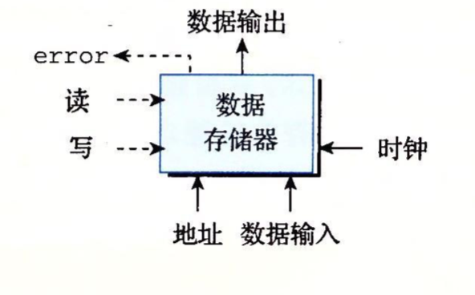

# 存储器和时钟

组合电路从本质上讲,**不存储任何信息**, 相反, **它们只是简单的相应输出信号**,**产生等于输入的某个函数的输出.**

**为了产生`时序电路`, 也就是有状态并且在这个状态上进行计算的系统, 我们必须引用按位存储信息的设备.`存储设备都是由同一个时钟控制的, 时钟是一个周期信号, 决定什么时候要把新值加载到设备中.`**

* **两种存储设备**
  * **`时钟存储器`**\(简称`寄存器`\), **存储单个位或字.  时钟信号控制寄存器加载输入值.**
  * **`随机访问存储器`**\(简称`内存`\), **存储多个字.  用地址来选择该读或该写哪个字.**
    * 随机访问存储器包括: 
      * 1\) _处理器的虚拟内存系统, 硬件和操作系统软件结合起来使处理器可以在一个很大的地址空间内访问任意的字._
      * \)2 _寄存器文件,  在此,寄存器标识符作为地址. 在IA32或Y86-64处理器种, 寄存器文件有15个程序寄存器\( %rax ~ %r14\);_

**在硬件和机器级编程\(汇编\) 时, “寄存器“ 这个词有细微的差别:**

* **在硬件中**
  * _**寄存器直接将它的输入和输出线连接到电路的其他部分.**_
* **在机器级编程中**
  * _**寄存器代表的是CPU 中为数不多的可寻址的字, 这里的地址是寄存器ID.**_ 这些字通常都存在寄存器文件中, 虽然我们会看到硬件有时可以直接将一个字从一个指令传送到另一个指令,以避免先写入寄存器文件再读出来的延迟.
* 为了避免歧义, 分别称呼这两类寄存器为 “硬件寄存器“ 和 “程序寄存器“

## 硬件寄存器的工作状态

大多数的时候,寄存器都保持在稳定状态\( **`用x表示`** \),产生的输出等于它的当前状态. 信号沿着寄存器前面的组合逻辑传播, **`(也就是左图的输出x)`**, 这时产生了一个新的寄存器输入\( **`用y表示,左图的 输入=Y`**\),但只要时钟是**低点位**的, **寄存器的输出就仍然保持不变**.  当时钟变成高电位的时候, 输入信号就加载到寄存器中, 成为下一个状态Y\(**`右图方框中的y`**\),知道下一个时钟上升沿, 这个状态一致是寄存器的新输出.

**`关键是寄存器是作为电路不用部分中的组合逻辑之间的屏障.` 每当每个时钟到达上升沿时,值才会从寄存器的输入传送到输出,\(**我们的Y86-64处理器会用时钟寄存器保存程序计数器\(PC\),条件代码\(CC\)和程序状态\(Stat\)\)

## 寄存器文件

**程序寄存器存在CPU中的一个寄存器文件中,** **`这个寄存器文件就是一个小的,以寄存器ID作为地址的随机访问存储器.`**

**寄存器文件有两个读端口\(A和B\), 还有一个写端口 \(W\). 这样一个多端口随机访问存储器允许同时进行多个读和写操作.**

**上图寄存器文件中, `电路可以读取两个程序寄存器的值, 同时更新第三个寄存器的状态`. 每个端口都有一个`地址输入`,`表明该选择哪个程序寄存器`,另外还有`一个数据输出`或`对应程序寄存器的输入值`.**

地址使用 编码表示的寄存器标识符\( `0代表%rax,1代表%rcx`\).

两个读端口有**地址输入`srcA 和 srcB`** , 以及**数据输出** **`valA  和valB`**. **写端口**有**地址输入 `dstW,`** 以及**数据输入** **`valW`**.

**`虽然寄存器文件不是组合电路, 因为它有内部存储.`** **不过在实现中,从寄存器文件读数据就好像它是一个以地址为输入, 数据为输出的一个组合逻辑块.**  `当srcA或srcB被设成某个寄存器ID时, 在一段延迟之后(时钟控制)`,`存储在相应程序寄存器的值就会出现在 valA或valB 上, 例如,将srcA设置为3,就会独处程序寄存器%rbx的值,然后这个值就会出现在输出 valA上.`

**向寄存器文件写入字是由时钟信号控制的, 控制方式类似于将值加载到时钟寄存器,** 每次时钟上升时,输入 valW 上的值会被写入 **输入dstW** 上的寄存器ID 只是的程序寄存器. 当 dstW 设为特殊的ID值 0xF 时, 不会写入和程序寄存器.

**由于寄存器文件既可以读也可以写, 一个很自然的问题就是 `“如果我们试图同时读和写同一个寄存器会发生什么?“` 答案简单明了:** _**如果更新一个寄存器,同时在读端口上用同一个寄存器ID, 我们会看到一个旧值到新值的变化.**_   当把寄存器文件加入到处理器设计中,应该保证考虑这个属性.

## 随机访问存储器

**处理器有一个随机访问存储器来存储程序数据. \(主要是对内存进行操作\)**

这个内存有一个**地址输入**,  一个写的**数据输入**, 以及一个读的**数据输出.**

**同`寄存器文件`一样, 对内存的操作方式类似于组合逻辑**

* **从内存中读的操作**
  * 在**地址输入上** `提供一个地址`. 将 **写控制信号**`设置为0,`将**读信号**`设置为1`
    * 经过一些延迟后\(时钟\), 存储在那个地址上的值就会出现在 **数据输出** 上.
      * **如果地址超出了范围, error 信号会设置为1, 否则设置为0**
* **向内存中写的操作: \( 写内存是由时钟控制的.\)**
  * 在地址输入上 `提供一个地址`, 将**写信号**`设置为1,` 将**读信号**`设置为0`,将**数据输入**设置为**期望的值**
    * **然后当我们控制时钟时, 只要地址是合法的,就会更新内存中指定的位置.**
      * **如果地址过出了范围,或者不合法  error 信号还是会设置为1,否则设置为0**
        * 这个信号是由组合逻辑产生的,因为所需要的边界检查存储就是地址输入的函数, 不涉及保存任何状态.

**目前我们设计的处理器还包括另外一个`只读存储器`,**`用来读指令`**,  `在大多数实际系统中,这两个存储器被合并为一个具有双端口的存储器: 一个用来读指令,另一个用来读或写数据.`**

