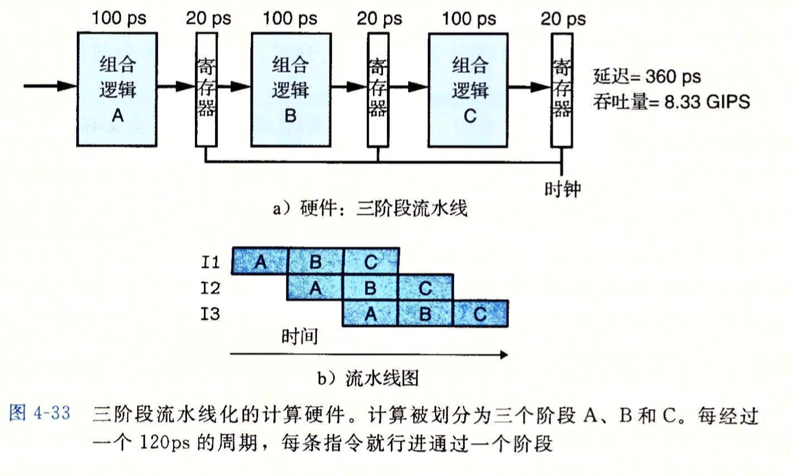

# 流水线

## 流水线的通用原理

流水线的特性: 提高了系统的吞吐量. 也就是单位时间内执行指令的个数. 但是会增加延迟.

流水线一般由执行计算和逻辑以及若干个保存结果的寄存器组成.  时钟信号控制在每个特定的时间间隔加载到寄存器.

### 流水线计算

单位  **`皮秒( 1ps   =`** $$10^-12$$  **`十的负12次方 )`**

**延迟  `从头到尾执行一条指令的时间. ( 如果是流水线,那么取某个执行时间最长阶段的执行时间, 乘上 阶段的个数, 就是延迟)`**

**吞吐量 `每秒执行的指令个数 (单位GIPS,每秒千兆条指令,也就是10亿条指令,<1兆 = 1百万>)  ,计算公式 :`** 

$$
1000/某个执行时间最长阶段的执行时间 ps = 吞吐量(GIPS 可以是约等于,保留两位小数点).
$$

上图吞吐量计算式 是  :  **1000/120 = 8.33 GIPS**

上图延迟计算式  是 :  **\(100+20 \)\* 3 = 120\*3 = 360 ps**

吞吐量计算是 :   **1000/\(150+20\) = 1000/170 = 5.88 GIPS**

延迟计算是  :      \( **150+20 \)\*3  =  170 \* 3 =510 ps**

### 流水线的详细说明

### 流水线的局限性

1. **不一致的划分**
   1. **每个阶段的延迟不相等**
2. **流水线过深, 收益下降**

