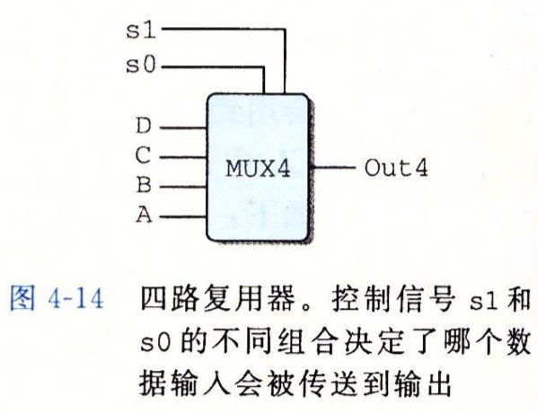
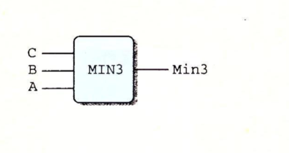
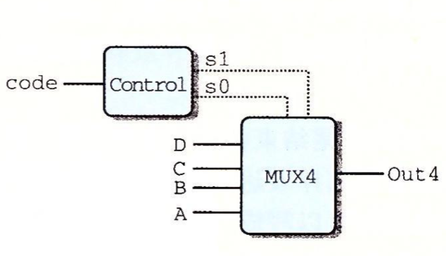

# 逻辑设计和硬件控制语言 HCL

在硬件设计中, 用**电子电路来计算对位运算的函数**, 以及在各种存储单元中存储位.

大多数现代电路技术都是用信号线上的**高电压**和**低电压**来表示不同的值, 在当前的技术中, **逻辑1是用1.0伏特左右的高电压表示的**, **而逻辑0是用0.0伏特左右的低电压表示的.**

* **一个数字系统需要三个组成部分:**
  * **计算对位操作的函数的组合逻辑**
  * **存储位的存储单元**
  * **控制存储单元更新的时钟信号**

**使用 `HCL`  \(硬件控制语言\)  来描述不同处理器设计的控制逻辑.\(描述的是硬件结构,不是程序行为\)**

**控制逻辑 是设计微处理器中做难的部分.**

## 逻辑门

**逻辑门是数字电路的基本计算单元,  它们产生的输出, 等于它们输入位的某个布尔函数.**

* **HCL和C语言很像,对位运算.**
  * **AND**  用    **`&&`**  表示
  * **OR**     用   **`||`**   表示
  * **NOT**  用   **`!`**    表示

**逻辑门是对单个位的数进行操作,而不是整个字.**

**逻辑门总是活动的, 一旦一个门的输入变化了, 在很短时间内,输出就会相应地变化.**


## 组合电路和 HCL 布尔表达式

**将很多的逻辑门组合成一个网, 就能构成 `计算块` 称为 `组合电路.`**

* **构建网的限制**
  * **每个逻辑门的输入必须连接到下述选项之一:**
    * **`一个系统输入(称为主输入)`**
    * **`某个存储器单元的输出`**
    * **`某个逻辑门的输出`**
  * **两个或多个逻辑门的输出不能连接在一起.**否则它们会使线上的信号矛盾, 可能会导致一个不合法的电压或电路故障.
  * **这个网必须是无环的.**就是在网中不能有路径经过一系列的门而形成一个回路, 这样的回路会导致该网络计算的函数有歧义.

### HCL和C的区别

**HCL 表达式很清楚地表明了组合逻辑电路和C语言中逻辑表达式的对应之处.  它们都是用布尔操作来对输入进行计算的函数.**

* **两种表达式计算方法之间的区别 \(  C和HCL \)**
  * **因为组合电路是由一系列的逻辑门组成, 它的属性是输出会持续的相应输入的变化. ``**`如果电路的输入变化了,在一定的延迟之后, 输出也会相应地变化`, **`相比之下C表达式只能在程序执行过程中被遇到时才进行求值.`**
  * **C 的逻辑表达式允许参数是任意整数, 0表示 FALSE ,其他任何值都表示 TRUE,  `而逻辑门只对位值0 和 1 进行操作.`**
  * **C 逻辑表达式有个属性就是 它们可能之被部分求值. 如果一个AND 或 OR  操作的结果 只用对一个参数求值就能确定,那么就不会对第二个参数求值了,  `例如 C表达式 ( a && !a) && func(b,c)`**    _`这里函数 func 是不会被调用的, 因为表达式 ( a && !a) 求值为0.`_  **而逻辑组合没有部分求值这条规则, 逻辑门只是简单的相应输入的变化.**


### 位级 单个位相等电路


上图的 HCL表达式为:   **`bool ep = ( a && b) || ( !a && !b)`**;      `上述代码简单的定义了位级 (数据类型bool表明了这一点) 信号eq ,  它是输入a和b的函数.`  `'=' 这个等号将信号名与一个表达式联系起来. 与c不同,它是给表达式一个名字,  ep这个名字就代表了后的表达式.`

### 位级多路复用器电路

**多路复用器根据输入控制信号的值, 从一组不同的数据信号中选出一个.**


**在这个单个位的多路复用器中,两个数据信号是`输入位 a 和 b` , `控制信号是输入位s`.**

**当s为`1`时, 输出等于`a`,   当s为`0`时, 输出等于`b`.**

**两个AND 门决定了是否将它们相对应的数据输入传送到 OR门.**

**HCL表达式为  :   `bool  out = (s && a) || ( !s  &&  b);`**


### 字级的组合电路和 HCL 整数表达式

**通过将逻辑门组合成大的网, 可以构造出计算更复杂函数的组合电路.**

**通常设计能够 对数据`字`\(word\) 进行操作的电路.  有一些`位级信号`,代表一个整数或一些控制模式.** `例如,我们的处理器设计将包含很多字,` **`字的大小范围为4到64位, 代表整数, 地址, 指令代码和寄存器标识符.`**

执行**`字级计算`**的**`组合电路`**根据**`输入字`**的**`各个位`**, 用**逻辑门**来计算**`输出字的各个位`**.


**上图就是个组合电路, 它测试`两个64位字 A 和 B 是否相等.`**

`也就是 当且仅当A的每一位都和B的相应位相等时, 输出才为1.  这个电路是用64个左侧图所示的单个位相等电路实现的. 这些单个位的电路的输出用一个AND门连起来,形成了这个电路的输出.`

**在HCL中, 我们将所有字段的信号都声明为`int,` 不指定字的大小. 这样做是为了简单.**

**HCL 允许比较字是否相等,因此上图所示的电路的函数可以在自己上表达成 `loob Eq =  ( A == B);`**  `这里参数 A 和 B 是int 型.`

右图的 **中等粗线** $$A$$ 和 $$B$$  代表携**带字的每一位的线路**,  而用**`虚线`**来表示**`布尔信号结果.`**


### 字级的多路复用器电路


_**这个电路根据控制输入位`s` , 产生一个64位的字 `out`, 等于两个输入字 `A` 和 `B` 中的一个.**_

_上面这个电路由64个相同的子电路组成, 每个子电路的结构都类似于 **`位级多路复用器.(在上面)`**_

_**这个电路只产生一次 `s!` , 然后在每个位的地方都重复使用它,从而减少反相器或非门的数量.**_

**处理器终会用到很多种多路复用器, 使得我们能根据某些控制条件, 从许多源中选出一个字.**

```r
多路复用函数是用情况表达式来描述的, 情况表达式的通用格式如下:
[
    select1   : expr1;
    select2   : expr2;
    select3   : expr3;
    select4   : expr4;
]
这个表达式包含一系列的情况 ,每种情况i 都有一个布尔表达式 select, 和一个整数表达式 expr,
    前者表明什么时候该选择这种情况,  后者指明的是得到的值
同C 的 witch 语句不同, 我们不要求不同的选择表达式之间互斥. 从逻辑上讲,这些选择表达式是顺序求值的,
    且第一个求值为1 的情况会被选中.

例如上图的 字节级多路复用器用 HCL 来描述就是:
word  Out = [
    s : A;
    1 : B;
];

# 这段代码中,第二个选择表达式就是1, 表明如果前面没有情况被选中,那就选择这种情况.这是HCL中一种
    指定默认情况的方法, 几乎所有的情况表达式都是以此结尾的.
```

_**允许不互斥的选择表达式使得 HCL 代码的可读性更好,实际的硬件多路复用器的信号必须互斥,它们要控制那些字符被传送到输出, 就行上图的 s 和 !s**_  

_**要将一个HCL 情况表达式翻译成硬件, 逻辑合成程序需要分析选择表达式集合, 并解决任何可能出现的冲突, 确保只有一个满足的情况才会被选中.**_

#### 四路复用器



```text
选择表达式可以是任意的布尔表达式,可以有任意多的情况.这就使得情况表达式能描述带负载选择标准的,多种
    输入信号的块.
```

上图的四路复用器, 这个电路控制信号 s1 和 s0 , 从4个输入字 A,B,C和D 中选择一个, 将控制信号看作一个二位的二进制数. 我们可以用 HCL 来表示这个电路,  用布尔表达式描述控制位模式的不同组合;

```text
word Out4 = [
    !s1  && !s0  : A;   #00
    !s1          : B;   #01
    !s0          : C;   #10
    1            : D;   #11
```


#### 找最小值的字



_HCL 表示是_

```text
word Min3 = [
    A <=  B  &&  A <= C : A;
    B <=  A  &&  B <= C : B;
    1                   : C;
];  
```

#### 选择中间值的字

有三个输入 A,B,C

```text
word  Med 3 = [
    A <= B  &&  B <= C : B;
    C <= B  &&  B <= A : B;
    B <= A  &&  A <= C : A;
    C <= A  &&  A <= B : A;
    1                  : C;
];
```

\_\_

## 算术/逻辑单元组合电路

组合电路可以在设计成字级数据上执行许多不同类型的操作**.**

**算数/逻辑单元\( ALU\) 是一种很重要的组合电路, 下面有个抽象图示.**


* 这个电路有三个输入:
  * 标号为 A 的数据输入
  * 标号为 B 的数据输入
  * 一个控制输入

_根据控制输入的设置,  电路会对数据输入执行不同的算数或逻辑操作._ 

上面 \( 0 1 2 3 \) 这些控制输入对应于 Y86-64 的\( add, sub, and ,xor \).而且减法操作是 B -A ,和subq 指令参数顺序一致.

## 集合关系

在处理器设计中, 很多时候需要将一个信号与许多可能匹配的信号作比较, 以此来检测正在处理的某个指令代码是否属于某一个类指令代码.



```text
上面这个电路中, 假设想从一个两位信号 code 中选择高位和低位来为 四路复用器产生信号 s1 和 s0.
# 两位信号 code 可以用来控制4个数据字 A,B,C,D  做选择,根据可能的code值,
    可以使用相等测试来表示信号s1和s0产生.
    bool  s1 =    code == 2   ||  code == 3;
    bool  s0 =    code == 1   ||  code == 3;

还有一种更简洁的方式来表示这样的属性:
    当code 在集合 { 2,3 } 中时 s1为1, 而code 在集合  { 1,3 } 中时 s0 为1:
        bool  s1 = code in  { 2,3 };
        bool  s0 = code in  { 1,3 };
            判断集合关系的通用格式是:
                        iexpr  in { iexpr1, iexpr2, ... iexprk }
                    这里被测试的值 iexpr 和带匹配的值 iexpr1 ~ iexprk 都是整数表达式.
```

