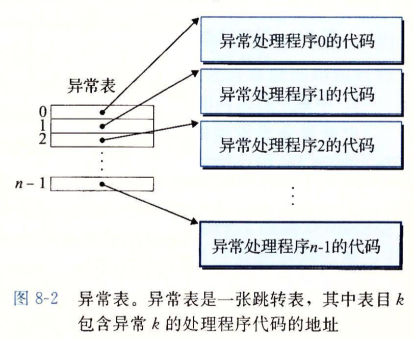

# 异常

## 异常

**异常**是 异常控制流的一种形式, 它一部分是由硬件实现的,  一部分是由操作系统实现的.

**异常 \(`exception`\)就是控制流中的突变, 用来相应处理器状态中的某些变化.**

在处理器中, 状态变化称为事件\(event\) . 事件可能和当前指令的执行直接相关.

任何情况下, 当处理器检测到有**事件**发生时, 它就会通过一张叫做**异常表**的跳转表, 进行一个间接过程调用\(**异常**\), 到一个专门设计用来处理这类事件的**操作系统子程序**\(**`异常处理程序`**\).

* 当异常处理程序完成处理器后,根据引起异常的事件类型会发生以下三种情况中的一种:
  * 处理程序将控制返回给 **`I_curr`**,即事件发生时正在执行的指令.
  * 处理程序将控制返回给 **`I_next`**,如果没有发生异常将会执行的下一条指令.
  * 处理程序  **终止被中断的程序.**

在C++ 和 Java 中,  catch , throw 和 try 语句形式提供的是 应用级ECF.

### 异常处理

* 处理异常需要硬件和软件的紧密合作.
* 系统中可能的每种类型的异常都分配了一个唯一的**`非负整数的异常号.`** 其中一些号码是由_**处理器**_的设计者分配的, 其他号码是由_**操作系统内核**_\(操作系统常驻内存的部分\)的设计者分配的.
  * **硬件 : 处理器 处理的异常包括:**
    * 零除, 缺页,  内存访问违例, 断点,  算术运算溢出.
  * **软件 :操作系统内核**
    * 系统调用  和  来自外部的 I/O 设备信号.
* 在操作系统启动时, 操作系统分配和初始化一张称为 **`异常表`** 的跳转表, 是的表目 k 包含异常 k 的**处理程序地址**.
* 在运行时\(当系统正在执行某个程序时\),
  * 处理器检测到发生了一个事件 
    * 然后确定了相应的异常号 k  
    * 随后处理器触发异常
      * 方法是 : 执行间接过程调用, 通过异常表的表目 k , 转到相应的处理程序.
* **异常号**是到**异常表中**的**索引**, 异常表的其实地址放在一个叫做**`异常表基址寄存器`**的特殊CPU寄存器里.

* **异常类似于过程调用, 但是也有一些不同之处**
  * **过程调用时, 在跳转到处理程序之前,处理器将返回地址压入栈中.**
    * 然而,根据异常的类型, 返回地址要么是**当前指令\(当事件发生时正在执行的指令\)**, 要么是**下条指令\(如果事件不发生,将会在当前指令后执行的指令\).**
  * **处理器也把一些额外的处理器状态压入栈里, 在处理程序返回时, 重新开始执行被中断的程序会需要这些状态.**
    * 比如, x86-64 系统会包含当前条件码的 EFLAGS寄存器和其他内入压入栈中.
  * 如果控制从用户程序转移到内核, 所有这些项目都被压到**内核栈中**, 而不是压到**用户栈中**
  * **异常处理程序允许在内核模式下, 这意味着它们对所有的系统资源都有完全的访问权限.**

一旦硬件触发了异常, 剩下的工作就是由异常处理程序在软件中完成.

* 在处理程序 处理完事件之后, 它通过执行一条特殊的 “从中断返回“ 指令, 可选的返回到被中断的程序.
  * **该指令将适当的状态弹回到处理器的控制和数据寄存器中**
  * **如果异常中断的是一个用户程序, 就将状态恢复为`用户模式,` 然后控制返回给你被中断的程序.**

