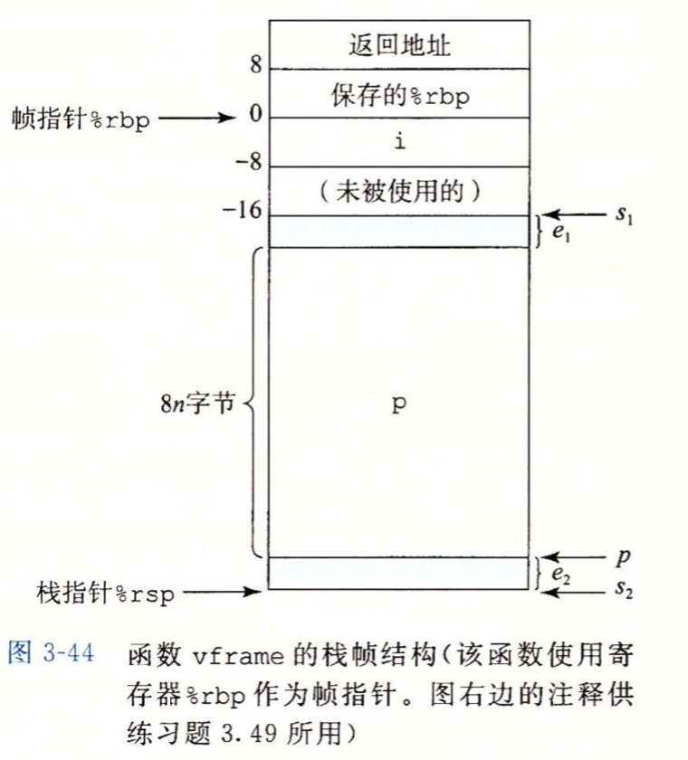

# 变长栈帧

## 变长栈帧

就是在函数中出现动态数组, 也就是说数组是变长的, 无法在编译时确定, 只有在程序运行时才可以确定数组的长度和所需空间.

**为了管理变长栈帧, 使用寄存器%rbp 作为帧指针, 也称基指针.**

```c
下面是一个C 函数代码, long *p[n] 这个数组是重点.
/*
这个函数接受3个参数，n idx *q
创建一个局部变量i
创建一个指针数组p，有n个元素
p[0]设为i的地址
p[1]到p[n-1]的值设为q
返回p[idx]的值
*/


long vframe(long n, long idx, long *q)
{
  long i;
  long *p[n];
  p[0] = &i;
  for (i = 1; i < n; i++)
        p[i] = q;
   return *p[idx];
}
```

```ruby
这里是汇编代码
vframe:
   pushq    %rdp           
   moveq    %rsp,%rdp         设置基指针
   subq     $16, %rsp         分配16字节的空间来储存i，i为long，只需要8个字节，但这里分配了16个字节，是为了内存16位对齐的原因，多余的8个字节将不被使用
   leaq     22(,%rdi,8),%rax   %rax=8n+22
   andq     $-16,%rax          %rax=(8n+22)&-16  这个计算将求得向下舍入16的最小的倍数，当n为奇数的时候为8n+8；当n为偶数的时候为8n+16;
   subq     %rax,%rsp          分配空间
   leaq     7(%rsp),%rax
   shrq     $3,%rax
   leaq     0(,%rax,8),%r8     以上计算将求得离得最近的8数 即&p[0]，并出入%r8中
   movq     %r8,%rcx           %rcx=p
 
  ## 代码执行到这里之后,寄存器的值会有所变化
  ## i是%rax(在栈内),n是%rdi,p是%rcx,q是%rdx
.L3:
   movq       %rdx,(%rcx,%rax,8)       将p[i]的值设为q
   addq       $1,%rax                  i++
   movq       %rax,-8(%rdp)            i值存进栈中
.L4:
   movq       -8(%rdp),%rax            获取i值
   cmpq        %rdi,%rax               对比i值和n值
   jl          .L3                     如果小于则跳转L3
   
   leave       #这条指令相当于执行了  movq %rbp,%rsp  和 popq %rbp  这两条指令.
   ret
```



**`主要注意数据对齐, 内存倍数,缓冲区溢出, 金丝雀值, 基指针计算, 空间预留, 栈指针.`**

```text
4的计算过程：
       8n+22=n*2^3+22
       -16的二进制=16的补码非+1
       16=0000 0000 0000.....0001 0000
       ^16=1111111111111.......1110 1111  +1=1111111111........1111 0000 
                     (n)   0  0  0
                    +1  0  1  1  0
与 1111......... 1111   0  0  0   0             可知如果n为奇数则结果为8n+8如果为偶数则为8n+16

```

变长栈帧